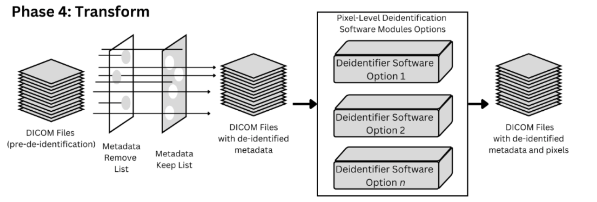
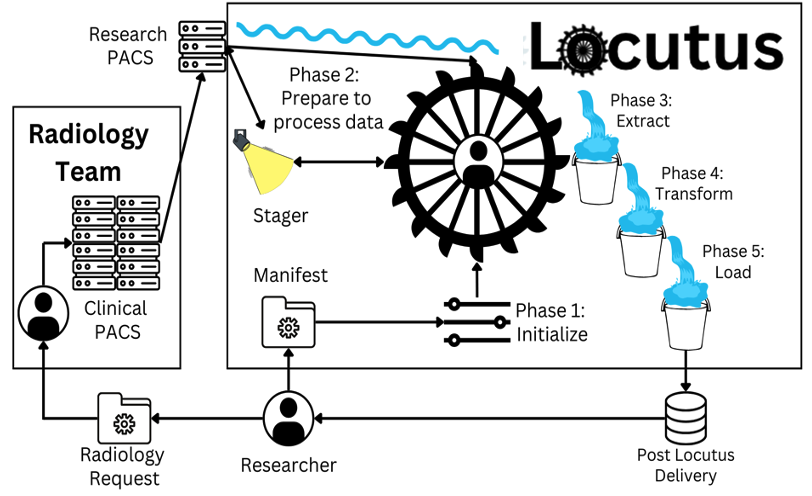

# Locutus


## **REFERENCE ONLY**
_last update: 26 October 2025_

The CHOP/UPenn Brain-Gene Development Lab ([BGD](https://www.bgdlab.org)), in partnership with CHOP's Translational Research Informatics Group ([TRiG](https://www.research.chop.edu/dbhi-translational-informatics)), is proud to present to you Locutus, our de-identification workflow framework. 

Please note that this is a _**reference snapshot**_ of Locutus, as from an internal repo at the Children's Hospital of Philadelphia Research Institute.  We include for your reference a sample Locutus module (**OnPrem DICOM De-ID**, as used to de-identify clinical radiology for BGD's research), and a sample Locutus command (**the Summarizer**, to assist in preloading and monitoring a batch of accessions for de-identification).

While we would very much like to offer a ready-to-play turnkey solution, there are many internal infrastructure dependencies that will currently require customization to integrate within your own infrastructure.  For example, an internal "TRiG Secrets Manager" package that was developed for secure access to [Vault](https://www.hashicorp.com/en/products/vault)-based TRiG unified secrets is still referenced by, though not included, in the Locutus code for this reference release.   Within such secrets lie the configurations and connection information for various Locutus components, including databases (within an instance of [Postgres](https://www.postgresql.org)) and our Research PACS (an instance of [Orthanc](https://www.orthanc-server.com)).

Should you be interested in helping generalize and enhance Locutus to make it more plug-and-playable outside of our internal CHOP infrastructure, please reach out to: 🚧 DL-locutus-support@chop.edu 🚧 (FORTHCOMING)

## LICENSE INFO

This project is released under a Non-Commercial Research License. For commercial use, please contact 🚧 DL-locutus-support@chop.edu 🚧 (FORTHCOMING) for licensing terms.

Non-Commercial Research License
Copyright ©2025 The Children's Hospital of Philadelphia.

Permission is hereby granted, free of charge, to any person or organization to use, copy, modify, and distribute this software and associated documentation files (the “Software”), for academic, research, or educational purposes only, subject to the following conditions:

1. Attribution
Appropriate credit must be given to the authors in any use, publication, or derivative work of the Software.

2. Non-Commercial Use Only
The Software may not be used, in whole or in part, for commercial purposes, including but not limited to:
use in a product for sale,
use in a for-profit company’s operations,
use in services provided to customers for a fee.

3. Commercial Licensing
For commercial use, a separate license must be obtained from the copyright holder. Please contact:
🚧 DL-locutus-support@chop.edu 🚧 (FORTHCOMING)

4. Warranty Disclaimer
THE SOFTWARE IS PROVIDED "AS IS", WITHOUT WARRANTY OF ANY KIND, EXPRESS OR
IMPLIED, INCLUDING BUT NOT LIMITED TO THE WARRANTIES OF MERCHANTABILITY,
FITNESS FOR A PARTICULAR PURPOSE AND NONINFRINGEMENT. IN NO EVENT SHALL THE
AUTHORS OR COPYRIGHT HOLDERS BE LIABLE FOR ANY CLAIM, DAMAGES OR OTHER
LIABILITY, WHETHER IN AN ACTION OF CONTRACT, TORT OR OTHERWISE, ARISING FROM,
OUT OF OR IN CONNECTION WITH THE SOFTWARE OR THE USE OR OTHER DEALINGS IN THE
SOFTWARE.


## De-ID Transform Phase



The key to the **OnPrem DICOM De-ID** module, as used to de-identify the DICOM metadata of clinical radiology for BGD's research, is:  [dicom-anon](https://github.com/chop-dbhi/dicom-anon).

The following Python code snippet shows its integration:

>                dicom_anon_Popen_args = [
>                    'python3',
>                    './src_3rdParty/dicom_anon.py',
>                    '--spec_file',
>                    DEFAULT_DICOM_ANON_SPEC_FILE,
>                    '--modalities',
>                    DEFAULT_DICOM_ANON_MODALITIES_STR,
>                    '--force_replace',
>                    curr_replacement_patient_info,  # for any 'R' specs (e.g., PatientsName & PatientID) in the dicom_anon_spec_file
>                    '--exclude_series_descs',
>                    DICOM_SERIES_DESCS_TO_EXCLUDE,
>                    '{0}'.format(curr_uuid_id_images_path),
>                    '{0}'.format(deidentified_dirname)
>                ]
>
>                proc = Popen(dicom_anon_Popen_args, stdout=PIPE, stderr=PIPE)
>                (stdoutdata, stderrdata) = proc.communicate()


Further excerpts from Children's Hospital of Philadelphia Research Institute internal repo for Locutus follow:

<A NAME="top"></A>
# Locutus



From the Latin word *locūtor* (“speaker, talker”), Locutus is a semi-automated processing workflow management system for modules and commands such as the following (as included in this reference repo):

    * OnPrem DICOM De-ID module
    * DICOM Summarizer command


This `README.md` will serve as a high-level overview and introduction into the implementation, configuration and usage details of Locutus, linking to the respective modules for further detail where applicable.  The following sections are currently available in this document:


* [Overview of Locutus Modules](#overview-of-locutus-modules)
* [High-Level Approach & Flow](#high_level_approach_and_flow)
    * [Historical Change-Driven Approach](#historical_change_driven_approach)
    * [Current Manifest-Driven Approach](#current_manifest_driven_approach)
    * [General Locutus Approach](#general_locutus_approach)
    * [Approach summarized for each Locutus Module](#approach_summarized_for_each_locutus_module)
        * [OnPrem DICOM De-ID module](#highlevel_onprem_dicoms)
        * [TODO: add DICOM Summarizer command](#highlevel_dicom_summarizer)
    * [Future Considerations to Approach](#highlevel_future)
* [DBs, Vault, Configurations & Manifest Formats](#configs)
    * [General Locutus configuration](#cfg_locutus)
    * [OnPrem DICOM De-ID module configuration](#cfg_onprem_dicoms)
        * [OnPrem DICOM De-ID module manifest](#cfg_onprem_dicoms_manifest)
    * [TODO: add DICOM Summarizer command configuration](#cfg_dicom_summarizer)
        * [TODO: DICOM add Summarizer command manifest](#cfg_dicom_summarizer_manifest)
* [Deployment](#deployment)
    * [Jenkins-based Deployment](#deployment_jenkins)
        * [Locutus-related jobs in TRiG's Jenkins](#deployment_jenkins_trig)
        * [locutus-sans-aperio-deploy job](#deployment_jenkins_sans_aperio)
        * [locutus-aperio-deploy job](#deployment_jenkins_aperio)
        * [deploying both Change- and Manifest- driven via Jenkins](#deployment_jenkins_hybrid_driven)
    * [Local Deployment](#deployment_local")
* [3rd Party Module Dependencies (in-house or not)](#3rd_party)


<A NAME="overview-of-locutus-modules"></A>
## Overview of Locutus Modules


High Level Program / Module | Data Type | Sources of Metadata | Functionality | Approach Details | Configuration & Manifest Info |
----- | ------- | ------- |  ------- | ------- | ------- |
**General Locutus**|  _"any"_ | _"any"_ | _"any"_ | [General Locutus approach](#highlevel_locutus) | [General Locutus config](#cfg_locutus) |
**OnPrem DICOM De-ID** (Radiology Imaging) |  DICOM Formatted objects (MRIs, X-Rays, CT scans, etc.) | Manifest, and accession information from Clinical Radiology (DICOM Metadata) | for each accession # in the manifest: <br/> \* download DICOM objects from our Research PACS (Orthanc), <br/> \* de-identify DICOM on prem, <br/> \* use metadata from manifest & DICOM to define bucket key, and <br/> \* deliver to target |[OnPrem DICOM De-ID approach](#highlevel_onprem_dicoms)| [OnPrem DICOM config & manifest](#cfg_onprem_dicoms) |


<A NAME="high_level_approach_and_flow"></A>
## High-Level Approach and Flow

The high-level flow is described below in general terms,
with additional details for each of the Locutus modules,
where applicable, as follows:

* [Historical Change-Driven Approach](#historical_change_driven_approach)
* [Current Manifest-Driven Approach](#current_manifest_driven_approach)
* [General Locutus Approach](#general_locutus_approach)
* [Approach summarized for each Locutus Module](#approach_summarized_for_each_locutus_module)
    * [OnPrem DICOM De-ID module](#highlevel_onprem_dicoms)
    * [TODO: add DICOM Summarizer command](#highlevel_dicom_summarizer)
* [Future Considerations to Approach](#highlevel_future)


<A NAME="historical_change_driven_approach"></A>
### Historical Change-Driven Approach

Locutus development began in 2018 with an initially MRI-focused, but DICOM generalized, de-identification module
which was to automatically process any new MRIs appearing in our Research PACS,
an instance of Orthanc.  This entailed essentially launching Locutus as a service
through Jenkins, with a built-in polling mechanism utilizing
the following configuration keys:

* `locutus_run_mode` ("single" for a single-shot run;
"continuous" to keep running as a polling service)

* `locutus_continuous_wait_secs` (number of seconds to pause between any
"continuous" runs)

When using Jenkins to launch Locutus into the above
continuous mode, injecting a Jenkins environment variable `XTRA_DOCKER_RUN_FLAGS`
that includes `-d` will detach the Locutus docker container as
a background daemon, allowing the Jenkins job to immediately terminate.
However, omitting this flag and keeping the job running in the Jenkins
foreground allows the Jenkins job logging to be enjoyed "for free."
For further information on `XTRA_DOCKER_RUN_FLAGS`
and TRiG's corresponding `AAA-Jenkins-Setup` job's artifact script
(`general_infra/deploy_etl.sh`),
see [Jenkins-based Deployment](#deployment_jenkins).

r3m0 TODO: highlight REFERENCE to the Jenkins artifacts!

Although the current approach is now primarily Manifest-Driven
(as described in [the next section](#current_manifest_driven_approach)),
we may still encounter scenarios which could benefit from this
continuous Change-Driven processing approach.
With multiple Locutus configurations possible for multiple Locutus
deployments (whether through Jenkins or otherwise), the possibilities
are nearly limitless.
See [Future Considerations to Approach](#highlevel_future)
and [Deploying both Change- and Manifest- driven via Jenkins](#deployment_jenkins_hybrid_driven)
for further info....


<A NAME="current_manifest_driven_approach"></A>
### Current Manifest-Driven Approach

During initial prototype testing of the above
[Change-Driven Approach](#historical_change_driven_approach),
when it was time to start
digging into the DICOM data for the "Clinical Event Id"
as well as somehow try to determine the "Pre or Post" surgery status for each
"Accession Num", the decision was made to instead utilize a
Manifest-Driven approach.

Each of the Locutus modules now
currently expect an input manifest that specifies the particular
data items to process and De-ID (whether Aperio slides, DICOM objects, or respective reports)
along with any desired metadata which might be used during the processing
(e.g., in defining the target bucket key name).

Samples of expected manifest formats for each Locutus module may be found at:

* [OnPrem DICOM De-ID module manifest](#cfg_onprem_dicoms_manifest)

With this Manifest-Driven approach, Locutus now generally utilizes
a configuration setting of `locutus_run_mode="single"` since "continuous" polling
mode is not quite as applicable for a single-shot run of Manifest-Driven processing.
That said, it might be worth reiterating that we may still encounter scenarios
which could benefit from a continuous
[Change-Driven Approach](#historical_change_driven_approach) to processing.
With multiple Locutus configurations possible for multiple Locutus
deployments (whether through Jenkins or otherwise), the possibilities
are nearly limitless.
See [Future Considerations to Approach](#highlevel_future)
and [Deploying both Change- and Manifest- driven via Jenkins](#deployment_jenkins_hybrid_driven)
for further info....


<A NAME="general_locutus_approach"></A>
### General Locutus Approach with Processing Phases


While each "Phase" is somewhat loosely defined and may vary widely in
implementation across the modules,
each Locutus module generally processes through the following sequence
of Phases:


Setup: Variable Initilization | Phase01: General Prep | Phase02: Prep per Manifest Line | Phase03: EXTRACT (Download Locally) | Phase04: TRANSFORM (Deidentify) | Phase05: LOAD (Upload to Target) |
----- | ------- | ------- | ------- | ------- | -------
variable initialization: <br/> \* setup database tables <br/> \* confirm input manifest format <br/> \* confirm any input file shares | general prep work | prep work per manifest-line  | download or copy locally | deidentify | upload to target bucket, w/ the specific key defined per-module (starting with `<sdgID>/...`, where `<sdgID>` represents the particular Clinical Event ID)

To minimize the necessary disk space needed throughout each module's
processing, the Locutus modules will aim to process each source object/file
entirely though the above Phases before proceeding to the next source object
specified in the input manifest.  Early prototypes aimed to process download/copy
all Phase03 source objects/files before proceeding on to Phase04 for deidentification, but
disk space quickly became a limiting factor on any more than the smallest of
change sets or manifests.

To further minimize the necessary disk space needed throughout each module's
processing, interim files (those mid-stream processing outputs, other than the initial
source objects/files or final destination targets) are typically deleted
once they are no longer needed for processing.  For example, upon successfully
completing Phase04's Deidentification process, the module shall remove the
Phase03 local copy containing identifiable information
(that is, if Deidentification does indeed create a brand new file,
rather than happening "in place" on the existing identified file).  And upon
successfully completing Phase05's Upload process to configured target, the module shall remove
the corresponding locally deidentified file.

Of course, sometimes issues are in encountered in processing the objects/files.
When needing to access any of the interim files for further investigation,
an overall Locutus configuration setting of
`locutus_debug_keep_interim_files=True` may be defined,
and each such local interim file will remain.  Please only use this setting with
small input manifests, remaining mindful of the disk space.

To easily resume processing of any objects/files which may have encountered any
issues along the way (and were therefore not successfully progressed to a
subsequent Phase), the Locutus modules are generally implemented to also look
for any objects/files still in mid-processing at each and every Phase.
That is, once all of the source objects/files defined in a module's input manifest have been
processed, the module shall then look for any locally copied files from Phase03 and process them on
through to completion if possible, then look for any locally deidentified files from Phase04
and process them on through to completion if possible.

As such, once any issues around
processing a particular input objects/file are resolved, the interim input file should be
picked up at its respective Phase in processing, even if it is no longer listed in the
input manifest.


<A NAME="approach_summarized_for_each_locutus_module"></A>
### Approach summarized for each Locutus Module Processing Phase


Module |  Phase01: General Prep | Phase02: Prep per Manifest Line | Phase03: EXTRACT (Download Locally) | Phase04: TRANSFORM (Deidentify) | Phase05: LOAD (Upload to Target) |
----- | ------- | ------- | ------- | ------- | ------- |
OnPrem DICOM De-ID:<BR/>[`src_modules/module_onprem_dicom.py`](./module_onprem_dicom.py) | general prep work | prep work per manifest-line  | download DICOMDIR zip file locally from internal Research PACS (Orthanc) | deidentify locally using [`dicom_anon.py`](./dicom_anon.py) | upload to deidentified AWS bucket, s3 key=`<sdgID>/Radiology/<PreOrPost>/uuid_<uuid#>.zip` |


<A NAME="highlevel_onprem_dicoms"></A>
#### OnPrem DICOM De-ID module, additional approach details


<A NAME="highlevel_dicom_summarizer"></A>
### DICOM Summarizer command for DICOM modules, including the OnPrem DICOM modules
===> TODO:  add high level overview of the Summarizer


<A NAME="highlevel_future"></A>
### Future Considerations to Address in Approach

##### Refactoring code from the modules into Locutus core

As additional modules become available for processing,
alternative approaches might be considered in registering them with
Locutus.  Currently, any new modules are merely hard-coded into
`main_locutus.py`, along with all applicable calls to the modules'
`Setup()` and `Process()` methods.  If a module could instead register itself
with Locutus, then hardcoding of the various might be bypassed, with Locutus
merely expecting and calling the corresponding `Setup()` and `Process()` accordingly.

Even further, we may want consider that the modules
register their lower level processing methods (`Process_Phase01*()`,
`Process_Phase02*()`, and so on) with Locutus,
such that Locutus itself takes a more active role in the actual
details of such processing.
To be determined, however, is whether or not the various `Process()` methods of these
modules can actually be made consistent enough for Locutus to do so.
Ideally, each module might even specify its maximum number of phases,
along with each phase processing method,
rather than be limited to the current default maximum phase of 5.

Likewise, as more modules standardize upon and utilize a shared infrastructure
(e.g., eventually a `<module>_MANIFEST_STATUS` table for each module,
not just for the Aperio and DICOM modules),
more and more of this infrastructure handling can be provided by
Locutus' `main_locutus.py` itself.

At the very least, consider that Locutus should begin to provide a
framework and set of available methods for such standard procedures
as manifest processing, phase processing, etc.  Currently each module is responsible
for implementing everything within `Process()`, including their own manifest loops,
and there is certainly much overlapping redundant code that could be consolidated.

##### Enhancing the logging in Locutus

Eventually integrate with tools such as Kabana for Elastic Search logging,
but for now we primarily just take advantage of the "free logging" available
from Jenkins itself when deploying the job as a foreground job
(i.e., no `-d` included in the `XTRA_DOCKER_RUN_ARGS` referenced by
`general_infra/deploy_etl.sh`)

##### Going manifest-free (at least, manifest-once, after a 1-time manifest load)

Locutus currently expects a manifest for almost all of its processing.
The management of such batch manifests is left to the operators.
When dealing with multiple manifest variations throughout the lifecycle of a batch
(e.g., when filtering accessions on a status needing re-processing, etc.),
such manual manifest manipulations can become not only cumbersome, but potentially error-prone.

Ideally, a future Locutus enhancement shall include options to load a project manifest into a workspace one time (via, for example, a `load-manifest` command), and to thereafter process the project "manifest-free", either in its entirety, or by way of a configurable filter (e.g., only those currently in a non-PROCESSED state, etc.).

It may also be worth noting here that our Jenkins instance is used to deploy not only DICOM De-ID jobs on an as needed basis, but also DICOM Summarizer jobs, whether ad hoc or regularly scheduled (e.g., nightly detailed Summarizers, with weekly overview Summarizers).  Any such regulary scheduled Jenkins jobs currently require that a manifest initially be attached to the Jenkins job, with subsequent scheduled deployments reusing the same manifest.  This generally works quite well, but whenever the Jenkins instance goes through a system upgrade (such as during an RIS Quarterly Maintenance weekend) or otherwise requires an unanticipated cleanup,
each Jenkins job will need the latest manifest manually re-attached.  With many such regularly scheduled Summarizers automated through Jenkins, this can likewise be unnecessarily cumbersome and potentially error-prone.

Such a "manifest-once" enhancement, though still manifest-driven, would significantly streamline the entire processing lifecycle for a batch, from De-ID through to the Summarizer.

<A NAME="configs"></A>
## DBs, Vault, Configurations & Manifest Formats

The Vault-based database credentials and application configuration information, and samples of expected manifest formats,
where applicable, are described below for each of the following Locutus modules:

* [General Locutus configuration](#cfg_locutus)
* [OnPrem DICOM De-ID module configuration](#cfg_onprem_dicoms)
    * [OnPrem DICOM De-ID module manifest](#cfg_onprem_dicoms_manifest)


NOTE: The primary Locutus configuration shall be supplied as `./config.yaml` (as originally stored in Vault),
but within it might exist Vault paths to additional configurations for each module,
thereby negating the need for replication of such configs.


<A NAME="cfg_locutus"></A>
### General Locutus: DB, Vault and Configs

###### Vault-based Database credentials for the Locutus DB

`namespace:/rootpath/databases/locutus`

```
Keys
----
db_host
db_name
password
user
```

###### Vault-based App Config for Locutus

`namespace:/rootpath/locutus`

```
Keys
----
develop
prod2dev
production
```

NOTE: the various Vault-based application configuration environments, under each of: `production`, `develop`, and in some cases even a `prod2develop` (to extract real data objects from a production-based stage, but to process them into the development environment).


The above Locutus configuration in Vault may specify following Locutus-general and Locutus module-specific configuration keys, as shown with a sample of each module-specific manifest, below:

###### Locutus general configuration keys:

configuration key | sample default value | description |
---- | ---- | ---- |
locutus_target_use_isilon:     | False | if "True", use a destination on a mounted CHOP RIS isilon drive |
locutus_target_isilon_path:     | "" | target destination mount point on the CHOP RIS isilon drive |
locutus_target_use_s3:     | False | if "True", use a destination bucket on CHOP's Managed AWS s3 |
locutus_target_s3_bucket:     | chop-dbhi-eig-locutus | destination bucket for uploads into CHOP's Managed AWS s3 |
locutus_target_use_gs:     | False | if "True", use a destination bucket on CHOP's Managed GCP GS |
locutus_target_gs_bucket:     | dicom-alpha-bucket | destination bucket for uploads into CHOP's Managed GCP GS |
locutus_DB_vault_path: | namespace:/rootpath/databases/locutus | Vault path to Locutus DB credentials |
locutus_DB_use_dev_suffix: | False | enable with "True" to use the below `locutus_DB_dev_suffix`  |
locutus_DB_dev_suffix: | | use "_dev" when wanting to use the `locutus_dev` DB rather than its production DB from the above `locutus_DB_vault_path`redentials |
locutus_DB_drop_tables: | False | use "True" only if wanting to drop the DB tables |
locutus_run_mode: | single | "single" for a single-shot run;<BR/>"continuous" to keep running (less applicable for manifest-driven processing) |
locutus_continuous_wait_secs: | 45 | seconds to pause between any "continuous" runs |
locutus_dicom_run_mode_continue_to_manifest_convergence: | False | a pseudo-continuous mode to iteratively process the entire manifest up to convergence_max_iterations (currently hard-coded to 11) times, terminating sooner if the number of errors and number processed stabilize, allowing the semi-automatic resolution of seemingly random errors due to any network time-outs and such |
locutus_verbose: | False | use "True" for more verbose output |
locutus_test: | False | use "True" to ensure that no DB data actually changed or files processed |
locutus_force_success: | False | use "True" to avoid non-0 returns for any errors not actually fatal.  For example, enable for Jenkins-based deployment with manifest-skimming sub-batch processing to work around Samba-Docker issues inherent to CHOP's Aperio slide file systems, or with occasional network connection errors,  to help ensure that processing continues even if unsuccessful on any particular objects. |
locutus_debug_keep_interim_files: | False | use "True" to *not* delete any interim files created during processing;<BR/>default is to delete such temporary files once subsequent processing Phases are completed |
locutus_allow_processing_of_duplicates: | False | use "True" when, for example, setting up large tests of the same accession |
locutus_disable_phase_sweep: | False | use "True" when processing multiple jobs concurrently, to *not* sweep for any objects awaiting Phase 4 or Phase 5 processing;<BR/>default is False, to sweep for any objects not yet completely processed (through Phase 5) once the manifest-driven Phases 1-3 are completed, but this can cause unintended job contention side-effects with concurrent deployments (Currently only supported by some modules) |
locutus_expand_phase_sweep_beyond_manifest: | False | use "True" when wanting to processing *any* objects awaiting Phase 4 or Phase 5 processing;<BR/>default is False to limit phase sweeps (when not otherwise disabled) to any objects not yet completely processed (through Phase 5) that are listed within the current input manifest (Currently only supported by the DICOM modules) |
locutus_workspaces_enable: | False | use "True" when wanting to decouple a project's DB tables from the standard set of Locutus tables, allowing any multi-project accessions to have their own project-specific attributes. |
locutus_workspace_name: | "default" | to identify & configure the Locutus module+workspace table names when `locutus_workspaces_enable` is  "True". |
Jenkins' JOB_DESCRIPTION: | "" | informational info for CFG_OUT|
Jenkins' INPUT_MANIFEST_NAME: | "" | informational info for CFG_OUT, to supplement the fixed-name Jenkins input manifest parameter |
Jenkins' ENV_CONFIG_PATH: | "." | informational info for CFG_OUT, to represent the path to the `config.yaml`configuration |
Jenkins' JENKINS_BUILD_NAME: | "" | informational info for CFG_OUT, of the general Jenkins job deployed |
Jenkins' JENKINS_BUILD_NUMBER: | "" | informational info for CFG_OUT, of the specific Jenkins job # deployed |
Jenkins' LOCUTUS_DOCKERHOST_CONTAINER_NAME: | "" | informational info for CFG_OUT, of the current Docker container's name as deployed |
Jenkins' LOCUTUS_DOCKERHOST_IMAGE_TAG: | "" | informational info for CFG_OUT, of the Docker image deployed into the current container |


<A NAME="cfg_onprem_dicoms"></A>
### OnPrem DICOM De-ID module: DB, Vault, Configs, and Manifests

###### Vault-based App Config for for the upstream source OnPrem DICOM Staging

`namespace:/rootpath/trig-dicom-staging`

```
Keys
----
develop
prod2dev
production
```

###### Vault-based Database credentials for the upstream source OnPrem DICOM Staging DB

`namespace:/rootpath/databases/trig_dicom_staging`

```
Keys
----
db_host
db_name
password
user
```


###### OnPrem-DICOM-DeID module-specific configuration keys in the [General Locutus configuration](#cfg_locutus):

configuration key | sample default value | description |
---- | ---- | ---- |
process_onprem_dicom_images: | False | use "True" for Locutus to process this module;<BR/>may be overriden by environment variable: `process_onprem_dicom_images` |
locutus_onprem_dicom_input_manifest_csv: | onprem_dicom_images_manifest.csv | name of the input manifest file expected to exist in the deployment job's workspace directory;<BR/>may be overriden by environment variable: `onprem_dicom_images_manifest` |
onprem_dicom_stage_config_vault_path:     | namespace:/rootpath/trig-dicom-staging/production | Vault path to the OnPrem DICOM Staging configuration |
locutus_onprem_dicom_zip_dir: | /data/locutus_production/onprem-dicom/phase03_orthanc_ids | path on deployment host for interim files|
locutus_onprem_dicom_deidentified_dir: | /data/locutus_production/onprem-dicom/phase04_dicom_deids | path on deployment host for interim files |
locutus_onprem_dicom_bucket_path_top_level: | .TopLevel | optional top-level path prefix key for target buckets |
locutus_debug_onprem_dicom_force_reprocess_accession_status: | False | use "True" to allow allow the re-processing of an accession numbers status record to allow easily re-running the same accession for new configurations, etc., retaining and adding new de-id'd targets as processed
locutus_debug_onprem_dicom_predelete_accession_status: | False | use "True" to first delete and then process any manifest-driven input which may have already completed processing (allowing for updated re-processing with the current code base or config) |
locutus_debug_onprem_dicom_preretire_accession_status: | False | use "True" to first "retire" (set accession_num to negative) and then process any manifest-driven input which may have already completed processing (allowing for updated re-processing with the current code base or config) |
locutus_debug_onprem_dicom_preretire_accession_status_only_changed: | False | use "True" to first "retire" and then process any manifest-driven input which may have already completed processing, but only for those accessions whose manifest attributes have changed (much more efficient than the full "preretire" if only wanting to reprocess due to changed attributes rather than code or config) |
locutus_debug_onprem_dicom_allow_continued_processing_if_only_cfgs_changed: | False | use "True" to continue processing a partially processed accession for which the previously processed internal configs have since changed |
locutus_onprem_dicom_manual_deid_QC_orthanc_config_vault_path:     | namespace:/rootpath/locutus/manual_deid_qc_orthanc/production | Vault path to condensed config for the DeID QC Orthanc instance |
locutus_onprem_dicom_deid_pause4manual_QC_disable: | True | use "False" to enable a pause for manual QC step |
locutus_onprem_dicom_use_manifest_QC_status: | False | use "True" to indicate reprocessing or pass of the manual QC step (see sample manifest below for the additional DEID_QC_STATUS column possibilities) |
locutus_onprem_dicom_use_manifest_QC_status_if_fail_remove_study_from_deidqc: | False | use "True" to remove study from the manual DeID QC Orthanc |
locutus_onprem_dicom_subject_ID_preface: | | use any value as a preface to the subject_ID, typically to temporarily help group studies within a manual DeID QC Orthanc; NOTE: will NOT be applied with a qc_status of PASS:* to reprocess, since wanting no such prefaces for the final de-id data |
<A NAME="cfg_onprem_dicoms_manifest"></A>

###### Sample of expected manifest format for <U>onprem_dicom_images_manifest.csv</U>, with `locutus_onprem_dicom_use_manifest_QC_status=False`:

SUBJECT_ID | imaging_type | age_at_imaging_(days) | anatomical_position | ACCESSION_NUM | DEID_QC_STATUS | locutus_manifest_ver:locutus.onprem_dicom_deid_qc.2021march15 |
--- | --- | --- | --- | --- | --- | --- |
C123456 | Radiology | 	1122 | brain |	1234640 | | |
C123456 | Radiology | 	1223 | brain |	1234669 | | |
C123456 | Radiology | 	1345 | brain |	1234663 | | |
C123456 | Radiology | 	1456 | brain |	1234670 | | |
C123456 | Radiology | 	1457 | brain |	1234676 | | |
C123456 | Radiology | 	1567 | brain |	1234697 | | |
C333221 | Radiology | 	905 | spine |	1234661 | | |
C333221 | Radiology | 	910 | spine |	1234680 | | |
C333221 | Radiology | 	1111 | spine |	1235008 | | |
C333221 | Radiology | 	1122 | spine |	1235015 | | |
C333221 | Radiology | 	1234 | spine |	1235112 | | |
C333221 | Radiology | 	1234 | spine |	1235123 | | |


Furthermore, should `locutus_onprem_dicom_use_manifest_QC_status=True`, 
available options for the `DEID_QC_STATUS` include:
* **PASS**:* = reprocess with the approved configurations and bypass the Manual DeiD QC instance, thereby ensuring that all resulting de-identified data is reproducible without any further manual intervention);
* **PASS_FROM_DEIDQC**:* = pull directly from the Manual DeiD QC instance (e.g., ORTHANCDEIDQC), allowing for any manual alterations to the study while on ORTHANCDEIDQC, wherever such exceptions might be required/desired;
* **REPROCESS**:* = reprocess all the way back from the source Orthanc, but pausing again at the Manual DeID QC step;
* **FAIL**:* = terminate processing of the study and note it as a FAIL (at least until any later REPROCESS:* attempts, should suitable configs become available).

###### Sample of expected manifest format for <U>onprem_dicom_images_manifest.csv</U>, including `DEID_QC_STATUS` values for `locutus_onprem_dicom_use_manifest_QC_status=True`, including:

SUBJECT_ID | imaging_type | age_at_imaging_(days) | anatomical_position | ACCESSION_NUM | DEID_QC_STATUS | locutus_manifest_ver:locutus.onprem_dicom_deid_qc.2021march15 |
--- | --- | --- | --- | --- | --- | --- |
C123456 | Radiology | 	1122 | brain |	1234640 | PASS: | |
C123456 | Radiology | 	1223 | brain |	1234669 | PASS: as is | |
C123456 | Radiology | 	1345 | brain |	1234663 | PASS_FROM_DEIDQC: manually adjusted | |
C123456 | Radiology | 	1456 | brain |	1234670 | PASS_FROM_DEIDQC: manually removed external series | |
C123456 | Radiology | 	1457 | brain |	1234676 | PASS_FROM_DEIDQC: manually removed external series | |
C123456 | Radiology | 	1567 | brain |	1234697 | PASS_FROM_DEIDQC: as is anyhow| |
C333221 | Radiology | 	905 | spine |	1234661 | FAIL: | |
C333221 | Radiology | 	910 | spine |	1234680 | FAIL: corrupt data | |
C333221 | Radiology | 	1111 | spine |	1235008 | FAIL: not applicable | |
C333221 | Radiology | 	1122 | spine |	1235015 | REPROCESS: update da cfgs  | |
C333221 | Radiology | 	1234 | spine |	1235112 | REPROCESS: update da cfgs  | |
C333221 | Radiology | 	1234 | spine |	1235123 | REPROCESS: update da cfgs  | |


<A NAME="deployment"></A>
## Deploying Locutus


Aspects of deployment via Locutus is discussed briefly in the following sub-sections:

* [Jenkins-based Deployment](#deployment_jenkins)
    * [deploying both Change- and Manifest- driven via Jenkins](#deployment_jenkins_hybrid_driven)
* [Local Deployment](#deployment_local)


<A NAME="deployment_jenkins"></A>
### Jenkins-based Deployment


When using Jenkins to launch Locutus into the above
continuous mode, injecting a Jenkins environment variable `XTRA_DOCKER_RUN_FLAGS`
that includes `-d` will detach the Locutus docker container as
a background daemon, allowing the Jenkins job to immediately terminate.
However, omitting this flag and keeping the job running in the Jenkins
foreground allows the Jenkins job logging to be enjoyed "for free."
For further information on `XTRA_DOCKER_RUN_FLAGS`
and the `AAA-Jenkins-Setup` job's artifact script, `general_infra/deploy_etl.sh`,
which processes them, see [Jenkins-based Deployment](#deployment_jenkins).


<A NAME="deployment_jenkins_hybrid_driven"></A>
#### Deployment of Locutus as both Change-Driven and Manifest-Driven via Jenkins


Although the current approach is now primarily Manifest-Driven
(as described in [Manifest-Driven Approach](#current_manifest_driven_approach)),
we may still encounter scenarios which could benefit from the
continuous [Change-Driven Approach](#historical_change_driven_approach),
to processing.
With multiple Locutus configurations possible for multiple Locutus
deployments (whether through Jenkins or otherwise), the possibilities
are nearly limitless.

This might require multiple Jenkins jobs
(just as the Aperio has been split out into a separate one),
but can all still be done from the same Locutus code base.

NOTE: may still include SOME entry-points and configs for such non-manifest
auto processing (e.g., Path Report DeID -> RTF).


<A NAME="deployment_local"></A>
### Local Deployment

r3m0 TODO: WIP: noting tools such as the deploy scripts and the Conductor?

<A NAME="3rd_party"></A>
## 3rd Party Module Dependencies (in-house or not)

* dicom_anon.py from:
   https://github.com/chop-dbhi/dicom-anon
 (as used in the OnPrem DICOM module) using a snapshot up to latest known `python3` branch commit, of 18 Dec 2019:
   https://github.com/chop-dbhi/dicom-anon/commit/fddbee0a18cb9e2bebfe9bbd41a3a1e28c774fc8
   

   * related local doc [the README for dicom-anon](./docs/README_dicom-anon.md)


## We would like to wish you a most productive time with Locutus.

