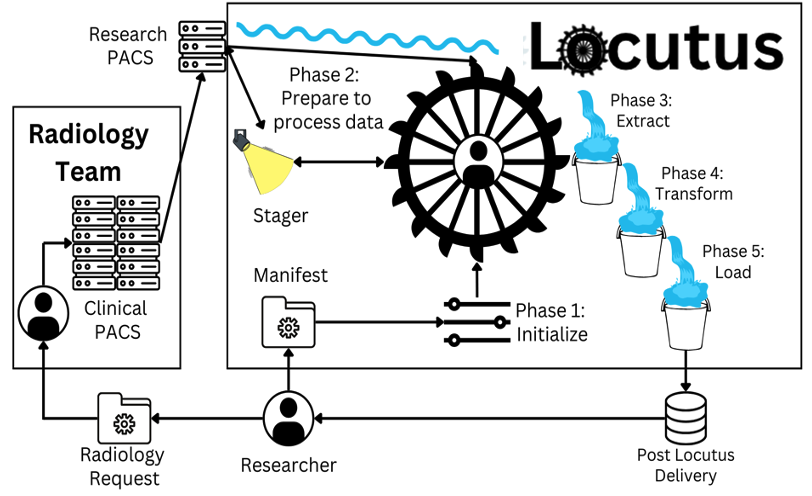
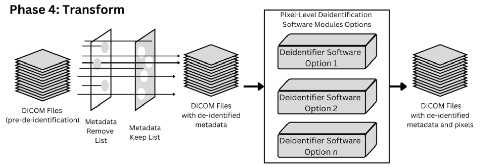
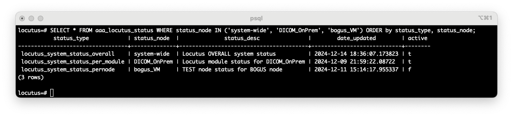
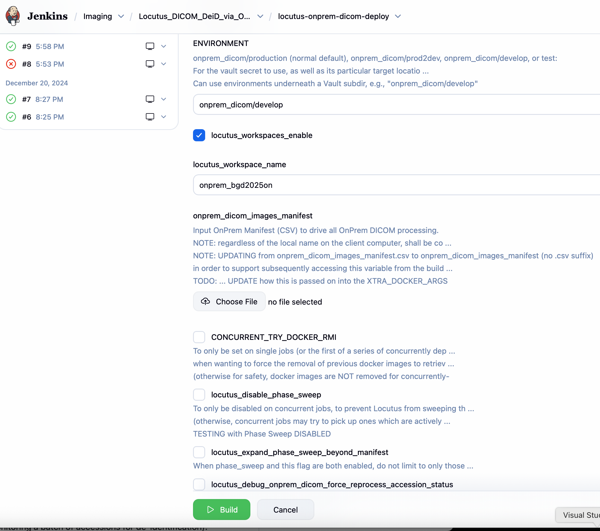

<A NAME="top"></A>

# Locutus


_last update: 16 December 2025_


The CHOP/UPenn Brain-Gene Development Lab ([BGD](https://www.bgdlab.org)), in partnership with CHOP's Translational Research Informatics Group ([TRiG](https://www.research.chop.edu/dbhi-translational-informatics)), is proud to present to you Locutus, our de-identification workflow framework. 



From the Latin word *locūtor* (“speaker, talker”), Locutus is a semi-automated processing workflow management system for modules and commands such as the following (as included in this reference repo):

    * OnPrem DICOM De-ID module
    * DICOM Summarizer command (including the Preloader sidecar)
    * Locutus System Status command

----------------------------------------------------------------

## De-ID Transform Phase



The key to the **OnPrem DICOM De-ID** module, as used to de-identify the DICOM metadata of clinical radiology for BGD's research, is  [dicom-anon](https://github.com/chop-dbhi/dicom-anon).

The following Python code snippet shows its integration from the **OnPrem DICOM De-ID** module:

>                dicom_anon_Popen_args = [
>                    'python3',
>                    './src_3rdParty/dicom_anon.py',
>                    '--spec_file',
>                    DEFAULT_DICOM_ANON_SPEC_FILE,
>                    '--modalities',
>                    DEFAULT_DICOM_ANON_MODALITIES_STR,
>                    '--force_replace',
>                    curr_replacement_patient_info,  # for 'R's in dicom_anon_spec_file
>                    '--exclude_series_descs',
>                    DICOM_SERIES_DESCS_TO_EXCLUDE,
>                    '{0}'.format(curr_uuid_id_images_path),
>                    '{0}'.format(deidentified_dirname)
>                ]
>
>                proc = Popen(dicom_anon_Popen_args, stdout=PIPE, stderr=PIPE)
>                (stdoutdata, stderrdata) = proc.communicate()


----------------------------------------------------------------

<A NAME="reference_only"></A>

## **REFERENCE ONLY**

Please note that this is a _**reference snapshot**_ of Locutus, as from an internal repo at the Children's Hospital of Philadelphia Research Institute.  We include for your reference a sample Locutus module (**OnPrem DICOM De-ID**, as used to de-identify clinical radiology for BGD's research), and a sample Locutus command (**the Summarizer**, to assist in preloading and monitoring a batch of accessions for de-identification).

While we would very much like to offer a ready-to-play turnkey solution, there are many internal infrastructure dependencies that will currently require customization to integrate within your own infrastructure.

For example, an internal "TRiG Secrets Manager" package is still referenced by, though not included, in the Locutus code for this reference release. This package provides secure access to [Vault](https://www.hashicorp.com/en/products/vault)-based TRiG unified secrets that contain configurations and connection information for various Locutus components, including databases (within an instance of [Postgres](https://www.postgresql.org)) and our Research PACS (an instance of [Orthanc](https://www.orthanc-server.com)).
Please see the [Deploying Locutus](#deployment) section for further details.

Should you be interested in helping generalize and enhance Locutus to make it more plug-and-playable outside of our internal CHOP infrastructure, please reach out to us, at:
*  DL-locutus-support@chop.edu

----------------------------------------------------------------

<A NAME="license_info"></A>

## LICENSE INFO

This project is released under a Non-Commercial Research License. For commercial use, please contact us at DL-locutus-support@chop.edu for licensing terms.

Non-Commercial Research License
Copyright ©2025 The Children's Hospital of Philadelphia.

Permission is hereby granted, free of charge, to any person or organization to use, copy, modify, and distribute this software and associated documentation files (the “Software”), for academic, research, or educational purposes only, subject to the following conditions:

1. Attribution
Appropriate credit must be given to the authors in any use, publication, or derivative work of the Software.

2. Non-Commercial Use Only
The Software may not be used, in whole or in part, for commercial purposes, including but not limited to:
use in a product for sale,
use in a for-profit company’s operations,
use in services provided to customers for a fee.

3. Commercial Licensing
For commercial use, a separate license must be obtained from the copyright holder. Please contact:
    * DL-locutus-support@chop.edu

4. Warranty Disclaimer
THE SOFTWARE IS PROVIDED "AS IS", WITHOUT WARRANTY OF ANY KIND, EXPRESS OR
IMPLIED, INCLUDING BUT NOT LIMITED TO THE WARRANTIES OF MERCHANTABILITY,
FITNESS FOR A PARTICULAR PURPOSE AND NONINFRINGEMENT. IN NO EVENT SHALL THE
AUTHORS OR COPYRIGHT HOLDERS BE LIABLE FOR ANY CLAIM, DAMAGES OR OTHER
LIABILITY, WHETHER IN AN ACTION OF CONTRACT, TORT OR OTHERWISE, ARISING FROM,
OUT OF OR IN CONNECTION WITH THE SOFTWARE OR THE USE OR OTHER DEALINGS IN THE
SOFTWARE.


<BR/>

----------------------------------------------------------------

<A NAME="detailed_dox"></A>

# Detailed Locutus Documentation


The rest of this  `README.md` will serve as a high-level overview and introduction into the implementation, configuration and usage details of Locutus.

The following sections from the Children's Hospital of Philadelphia Research Institute's internal repo are provided here for your Locutus reference, linking to excerpts from the respective modules for further detail where applicable.

* [Overview of Locutus modules](#overview-of-locutus-modules)
* [High-Level Approach & Flow](#high_level_approach_and_flow)
    * [Historical Change-Driven Approach](#historical_change_driven_approach)
    * [Current Manifest-Driven Approach](#current_manifest_driven_approach)
    * [General Locutus Approach](#general_locutus_approach)
    * [Approach Summarized for each Locutus module](#approach_summarized_for_each_locutus_module)
        * [**OnPrem DICOM De-ID** module](#highlevel_onprem_dicoms)
        * [**DICOM Summarizer** command](#highlevel_dicom_summarizer)
			* [**DICOM Preloader** Summarizer sidecar](#highlevel_dicom_preloader)
		* [**Locutus System Status** command](#highlevel_locutus_system_status)
    * [Future Considerations to Approach](#highlevel_future)
* [DBs, Vault, Configurations & Manifest Formats](#configs)
    * [General Locutus configuration](#cfg_locutus)
    * [**OnPrem DICOM De-ID** module configuration](#cfg_onprem_dicoms)
        * [**OnPrem DICOM De-ID** module manifest](#cfg_onprem_dicoms_manifest)
    * [**DICOM Summarizer** command configuration](#cfg_dicom_summarizer)
        * [**DICOM Summarizer** command manifest](#cfg_dicom_summarizer_manifest)
    * [**DICOM Preloader** Summarizer sidecar configuration](#cfg_dicom_preloader)
        * [**DICOM Preloader** Summarizer sidecar manifest](#cfg_dicom_preloader_manifest)
	* [**Locutus System Status** command configuration](#cfg_system_status)
* [Deployment](#deployment)
    * [Local Deployment](#deployment_local)
    * [Jenkins-based Deployment](#deployment_jenkins)
        * [Deploying both Change- and Manifest- driven via Jenkins](#deployment_jenkins_hybrid_driven)
* [3rd Party Module Dependencies (in-house or not)](#3rd_party)
* [Please cite Locutus paper from AMIA Informatics Summit 2025](#amia_summit_2025)
* [Contact Us](#contact)


----------------------------------------------------------------

<A NAME="overview-of-locutus-modules"></A>

## Overview of Locutus modules


High Level Program / Module | Data Type | Sources of Metadata | Functionality | Approach Details | Configuration & Manifest Info |
----- | ------- | ------- |  ------- | ------- | ------- |
**General Locutus**|  _"any"_ | _"any"_ | _"any"_ | [General Locutus approach](#highlevel_locutus) | [General Locutus config](#cfg_locutus) |
**OnPrem DICOM De-ID** (Radiology Imaging) |  DICOM Formatted objects (MRIs, X-Rays, CT scans, etc.) | Manifest, and accession information from Clinical Radiology (DICOM metadata) | for each accession # in the manifest: <br/> \* download DICOM objects from our Research PACS (Orthanc), <br/> \* de-identify DICOM on prem, <br/> \* use metadata from manifest & DICOM to define bucket key, and <br/> \* deliver to target |[**OnPrem DICOM De-ID** approach](#highlevel_onprem_dicoms)| [OnPrem DICOM config & manifest](#cfg_onprem_dicoms) |


----------------------------------------------------------------

<A NAME="high_level_approach_and_flow"></A>

## High-Level Approach and Flow

The high-level flow is described below in general terms,
with additional details for each of the Locutus modules,
where applicable, as follows:

* [Historical Change-Driven Approach](#historical_change_driven_approach)
* [Current Manifest-Driven Approach](#current_manifest_driven_approach)
* [General Locutus Approach](#general_locutus_approach)
* [Approach Summarized for each Locutus module](#approach_summarized_for_each_locutus_module)
    * [**OnPrem DICOM De-ID** module](#highlevel_onprem_dicoms)
    * [**DICOM Summarizer** command](#highlevel_dicom_summarizer)
		* [**DICOM Preloader** Summarizer sidecar](#highlevel_dicom_preloader)
	* [**Locutus System Status** command](#highlevel_locutus_system_status)
* [Future Considerations to Approach](#highlevel_future)


----------------------------------------------------------------

<A NAME="historical_change_driven_approach"></A>

### Historical Change-Driven Approach

Locutus development began in 2018 with an initially MRI-focused, but DICOM-generalized, de-identification module
which was to automatically process any new MRIs appearing in our Research PACS,
an instance of Orthanc.

This entailed essentially launching Locutus as a service
through Jenkins, with a built-in polling mechanism utilizing
the following configuration keys:

* `locutus_run_mode` ("single" for a single-shot run;
"continuous" to keep running as a polling service)

* `locutus_continuous_wait_secs` (number of seconds to pause between any
"continuous" runs)

For further information on deployment, please also refer to the subsequent sections on [Deployment](#deployment) and  [Jenkins-based Deployment](#deployment_jenkins).


Although the current approach is now primarily Manifest-Driven
(as described in [the next section](#current_manifest_driven_approach)),
we may still encounter scenarios which could benefit from this
continuous Change-Driven processing approach.
With multiple Locutus configurations possible for multiple Locutus
deployments (whether through Jenkins or otherwise), the possibilities
really are nearly limitless.
See [Future Considerations to Approach](#highlevel_future)
and [Deploying both Change- and Manifest- driven via Jenkins](#deployment_jenkins_hybrid_driven)
for further info.


----------------------------------------------------------------

<A NAME="current_manifest_driven_approach"></A>

### Current Manifest-Driven Approach

During initial prototype testing of the above
[Change-Driven Approach](#historical_change_driven_approach),
when it was time to start
digging into the DICOM data for the "Clinical Event Id"
as well as somehow try to determine the "Pre or Post" surgery status for each
"Accession Num", the decision was made to instead utilize a
Manifest-Driven approach.

Each of the Locutus modules now
currently expect an input manifest that specifies the particular
data items to process and De-ID (whether Aperio slides, DICOM objects, or respective reports)
along with any desired metadata which might be used during the processing
(e.g., in defining the target bucket key name).

Samples of expected manifest formats for each Locutus module may be found at:

* [**OnPrem DICOM De-ID** module manifest](#cfg_onprem_dicoms_manifest)
* [**DICOM Summarizer** command manifest](#cfg_dicom_summarizer_manifest)
* [**DICOM Preloader** Summarizer sidecar manifest](#cfg_dicom_preloader_manifest)


With this Manifest-Driven approach, Locutus now generally utilizes
a configuration setting of `locutus_run_mode="single"` since "continuous" polling
mode is not quite as applicable for a single-shot run of Manifest-Driven processing.
That said, it might be worth reiterating that we may still encounter scenarios
which could benefit from a continuous
[Change-Driven Approach](#historical_change_driven_approach) to processing.
With multiple Locutus configurations possible for multiple Locutus
deployments (whether through Jenkins or otherwise), the possibilities
are nearly limitless.
See [Future Considerations to Approach](#highlevel_future)
and [Deploying both Change- and Manifest- driven via Jenkins](#deployment_jenkins_hybrid_driven)
for further info.


----------------------------------------------------------------

<A NAME="general_locutus_approach"></A>

### General Locutus Approach with Processing Phases

Locutus modules are designed to process data through a series of phases. While each "Phase" is somewhat loosely defined and may vary in
implementation across the modules, each Locutus module generally processes through the following sequence:

Setup: Variable Initilization | Phase01: General Prep | Phase02: Prep per Manifest Line | Phase03: EXTRACT (Download Locally) | Phase04: TRANSFORM (De-identify) | Phase05: LOAD (Upload to Target) |
----- | ------- | ------- | ------- | ------- | -------
variable initialization: <br/> \* setup database tables <br/> \* confirm input manifest format <br/> \* confirm any input file shares | general prep work | prep work per manifest-line  | download or copy locally | de-identify | upload to target bucket, w/ the specific key defined per-module (starting with `<sdgID>/...`, where `<sdgID>` represents the particular Clinical Event ID)

To minimize the necessary disk space needed throughout each module's
processing, modules aim to process each source object/file
entirely though the above Phases before proceeding to the next source object
specified in the input manifest.  While early prototypes aimed to process
download/copy all Phase03 source object files before proceeding on to Phase04
for de-identification, disk space quickly became a limiting factor.

Furthermore, interim files (those mid-stream processing outputs,
other than the initial source objects/files or final destination targets)
are typically deleted once they are no longer needed for processing.
For example, upon successfully completing Phase04's De-identification process,
the module shall remove the Phase03 local copy containing identifiable
information (that is, if de-identification does indeed create a brand new
file, rather than happening "in place" on the existing identified file).
And upon successfully completing Phase05's Upload process to configured target,
the module shall remove the corresponding locally de-identified file.

When issues are encountered in processing the objects/files,
an overall Locutus configuration setting of
`locutus_debug_keep_interim_files=True` may be defined to retain
these interim files.

Locutus modules are generally implemented to also look for any objects/files
still in mid-processing in case of premature termination of the module
by way of a "Phase Sweep" (if `locutus_disable_phase_sweep` is enabled). That
is, once all of the source objects/files defined in a module's input manifest
have been processed through as many phases as possible,
the module shall then Phase Sweep to look for any locally copied files
from Phase03 not yet de-identified and process them on through to completion if possible, then look for any locally de-identified files from Phase04 not yet uploaded, and process them on through the upload to completion, if possible.

If `locutus_expand_phase_sweep_beyond_manifest` is also enabled,  once any issues around
processing a particular input objects/file are resolved, the interim input file should be
picked up by a Phase Sweep at its respective Phase in processing, even if it is no longer listed in the input manifest.


----------------------------------------------------------------

<A NAME="approach_summarized_for_each_locutus_module"></A>

### Approach Summarized for each Locutus module Processing Phase


Module |  Phase01: General Prep | Phase02: Prep per Manifest Line | Phase03: EXTRACT (Download Locally) | Phase04: TRANSFORM (De-identify) | Phase05: LOAD (Upload to Target) |
----- | ------- | ------- | ------- | ------- | ------- |
**OnPrem DICOM De-ID**:<BR/>[`src_modules/module_onprem_dicom.py`](./src_modules/module_onprem_dicom.py) | general prep work | prep work per manifest-line  | download DICOMDIR zip file locally from internal Research PACS (Orthanc) | de-identify locally using [`dicom_anon.py`](./src_3rdParty/dicom_anon.py) | upload to de-identified AWS bucket, s3 key=`<sdgID>/Radiology/<PreOrPost>/uuid_<uuid#>.zip`, or local Isilon target |


----------------------------------------------------------------

<A NAME="highlevel_onprem_dicoms"></A>

### **OnPrem DICOM De-ID** module, additional approach details

As already shared up at the top of this reference, the **OnPrem DICOM De-ID** module's De-ID Transform Phase may generally be viewed as follows:


The key to the **OnPrem DICOM De-ID** module, as used to de-identify the DICOM metadata of clinical radiology for BGD's research, is  [dicom-anon](https://github.com/chop-dbhi/dicom-anon).
Its `dicom_anon_spec.dat` file serves as the DICOM metadata de-identification profile, a blend of both "remove list" and "keep list", with no further downstream pixel-level de-identification in this particular OnPrem module.


The following Python code snippet shows its integration from the **OnPrem DICOM De-ID** module
(in [`src_modules/module_onprem_dicom.py`](./src_modules/module_onprem_dicom.py#L3631-L3644)):

>                dicom_anon_Popen_args = [
>                    'python3',
>                    './src_3rdParty/dicom_anon.py',
>                    '--spec_file',
>                    DEFAULT_DICOM_ANON_SPEC_FILE,
>                    '--modalities',
>                    DEFAULT_DICOM_ANON_MODALITIES_STR,
>                    '--force_replace',
>                    curr_replacement_patient_info,  # for 'R's in dicom_anon_spec_file
>                    '--exclude_series_descs',
>                    DICOM_SERIES_DESCS_TO_EXCLUDE,
>                    '{0}'.format(curr_uuid_id_images_path),
>                    '{0}'.format(deidentified_dirname)
>                ]
>
>                proc = Popen(dicom_anon_Popen_args, stdout=PIPE, stderr=PIPE)
>                (stdoutdata, stderrdata) = proc.communicate()

Please notice the following `dicom-anon` flags as used for the above call from this **OnPrem DICOM De-ID** module:
* `--spec_file` DEFAULT_DICOM_ANON_SPEC_FILE, the `dicom_anon_spec.dat` file as a DICOM metadata de-identification profile
* `--modalities` DEFAULT_DICOM_ANON_MODALITIES_STR (`'cr,ct,dx,mr,nm,ot,rf,us,xa,xr'`) DICOM modality types to include (with all others to be quarantined)
* `--exclude_series_descs` DICOM_SERIES_DESCS_TO_EXCLUDE (`'screen save, dose report, basic text SR'`) screen-save-like DICOM series types to exclude (with all others to be quarantined) due to likelihood of PHI
*  `--force_replace` allows for the injection of a coded **Research_ID** to replace the DICOM metadata values for any such DICOM tags that are flagged with an "R" in the `dicom_anon_spec.dat` file, currently configured to replace the following tags:
	*  **Patient's Name (0010,0010)**
	*  **Patient ID (0010,0020)**

**PHI WARNING:** Even with using such a de-identification profile to allow DICOM metadata that is generally PHI-free, and excluding DICOM series that are more prone to PHI, such Protected Health Information can still slip through the cracks of DICOM de-identification.  This is especially true when DICOM objects are obtained from other institutions which might adhere to other practices.  For example, we have observed PHI in Series Description values as set by other institutions to include Physician or even Patient names.  The balance between (a) preventing any PHI to pass through de-identification, while (b) allowing enough DICOM metadata through de-identification to support downstream research, is an ever dynamic one, requiring vigilence and collaboration between the Locutus team and researchers.

Please also see the corresponding **OnPrem DICOM De-ID** module configuration and manifest sections, at:
* [**OnPrem DICOM De-ID** module configuration](#cfg_onprem_dicoms)
    * [**OnPrem DICOM De-ID** module manifest](#cfg_onprem_dicoms_manifest)


----------------------------------------------------------------

<A NAME="highlevel_dicom_summarizer"></A>

### **DICOM Summarizer** command for OnPrem De-ID module

The **DICOM Summarizer** command is to offer a module-agnostic view of the overall statuses of a manifest-supplied list of accessions within a Locutus workspace.  Detailed Summaries may be generated when using `dicom_summarize_stats_show_accessions`; otherwise, high-level Summarizer summaries of the overall batch will be generated.

Typical `manifest_status` values shown for each accession in a batch manifest might include:

* **NOT_FOUND**: no record yet exists the **Locutus MANIFEST** table (until Preloaded or De-ID'd).
* **PENDING_CHANGE**: record does exist in the **Locutus MANIFEST** table, but not yet in the **Locutus STATUS** table, as not yet Migrated from (or even in) the Stager DB.
* **ERROR_***: an error occurred mid-processing.  Enable Phase Sweep with re-De-ID to retry at current phase, or Force Reprocess to restart processing.
* **ERROR_MULTIPLE_CHANGE_UUIDS**: multiple distinct UUIDs found from the Stager DB.
* **PREVIOUS_PROCESSING_USED_***: De-ID completed previously, but with accession attributes that differ from those in the current batch manifest.
* **PROCESSED**: De-ID complete, with same accession attributes as current batch manifest.
* **PROCESSING_CHANGE_at_***: Either an active indication of the processing phase for a current De-ID run, or a zombie status from a formerly halted De-ID run. Enable Phase Sweep with re-De-ID to retry at current phase, or Force Reprocess to restart processing.

Further `manifest_status` values are available through use of the [**DICOM Preloader** Summarizer sidecar](#highlevel_dicom_preloader).

Please also see the corresponding **DICOM Summarizer** command configuration and manifest sections, at:
* [**DICOM Summarizer** command configuration](#cfg_dicom_summarizer)
    * [**DICOM Summarizer** command manifest](#cfg_dicom_summarizer_manifest)


----------------------------------------------------------------

<A NAME="highlevel_dicom_preloader"></A>

#### **DICOM Preloader** Summarizer sidecar for the OnPrem De-ID module

While the standard [**DICOM Summarizer** command](#highlevel_dicom_summarizer) will merely present a passive view of the current `manifest_status` for each accession in its input manifest (including status of `NOT_FOUND` when no corresponding **Locutus MANIFEST** record is yet found), the **DICOM Preloader** Summarizer sidecar is much more active.

To streamline monitoring ongoing statuses **DICOM De-ID** batches,
the **DICOM Preloader** Summarizer sidecar dynamically updates the **Locutus MANIFEST** table `manifest_status` for each accession in the batch manifest,
informed by that workspace's active accession records in the **Locutus STATUS** table (as most recently Migrated from the Stager DB), and appended with a _preload_suffix_.

In addition to those `manifest_status` values described in the above [**DICOM Summarizer** command](#highlevel_dicom_summarizer), the **DICOM Preloader** Summarizer sidecar also generates the following `manifest_status`:

* **ZZZ-ONDECK-PENDING_CHANGE**:_preload_suffix_
* **ZZZ-ONDECK-4-PROCESSING_CHANGE**:_preload_suffix_
* **ZZZ-ONDECK-4-RE-PROCESSING_CHANGE**:_preload_suffix_
* **ZZZ-ONDECK-2-RESOLVE-ERROR_MULTIPLE_CHANGE_UUIDS**:_preload_suffix_

The **DICOM Preloader** Summarizer sidecar also references the current setting for ...

* `locutus_debug_onprem_dicom_force_reprocess_accession_status` (with `dicom_summarize_stats_module='OnPrem'`, for the **OnPrem DICOM De-ID** module)

... in order to determine if an already-**PROCESSED** accessions shall be Preloaded as **ZZZ-ONDECK-*** for **RE-PROCESSING** (with `force_reprocess`=True) or left as **PROCESSED** (with `force_reprocess`=False).

**PRO TIP:** Preloading a Locutus **DICOM De-ID** batch allows for easy ad-hoc SQL queries that may be performed directly on the **Locutus MANIFEST** table.  These are especially fun while mid-processing multiple concurrent Locutus batches, reducing the need for calls to the full **DICOM Summarizer** command.

An example of one such SQL query follows:

```
locutus_db=# SELECT manifest_status, MIN(last_datetime_processing), MAX(last_datetie_processing), COUNT(*) FROM onprem_dicom_ws_PROJECT123_manifest WHERE last_datetime_processing >= `2025-11-20` GROUP BY manifest_status ORDER BY manifest_status;

                               manifest_status                        |            min             |            max             | count
-------------------------------------------------------------------+----------------------------+----------------------------+-------
 PROCESSED                                                         | 2025-11-20 14:34:24.132764 | 2025-12-09 14:26:48.32239  |  1601
 PROCESSING_CHANGE_at_PHASE03c_Downloading_from_Orthanc            | 2025-11-20 14:35:53.072866 | 2025-11-20 14:36:55.957974 |     2
 PROCESSING_CHANGE_at_PHASE04a_DeIDing_with_dicom-anon             | 2025-11-20 14:36:09.221297 | 2025-11-20 14:36:57.050756 |     6
 ZZZ-ONDECK-2-RESOLVE-ERROR_MULTIPLE_CHANGE_UUIDS:SCIT1640-batch01 | 2025-11-21 10:15:20.125422 | 2025-11-21 10:15:40.111435 |    94
 ZZZ-ONDECK-2-RESOLVE-ERROR_MULTIPLE_CHANGE_UUIDS:scit605-batch25  | 2025-12-08 14:43:27.71766  | 2025-12-08 14:44:24.823247 |    62
 ZZZ-ONDECK-PENDING_CHANGE:SCIT1640-batch01                        | 2025-11-21 10:15:20.217084 | 2025-11-21 10:15:40.612305 |    63
 ZZZ-ONDECK-PENDING_CHANGE:scit605-batch25                         | 2025-12-08 14:43:27.759736 | 2025-12-08 14:44:23.921358 |   102
(7 rows)
```

Please also see the corresponding **DICOM Preloader** Summarizer sidecar configuration and manifest sections, at:
* [**DICOM Preloader** Summarizer sidecar configuration](#cfg_dicom_preloader)
    * [**DICOM Preloader** Summarizer sidecar manifest](#cfg_dicom_preloader_manifest)


----------------------------------------------------------------

<A NAME="highlevel_locutus_system_status"></A>

#### **Locutus System Status** command

The **Locutus System Status** command has two modes:
* **Getter** mode (default), to query (_only_) the existing `active` status of the specified request type.
* **Setter** mode, to _update_ the `active` status of the specified request type, as below.

The **Setter** mode can be activated with the following settings:
*  `locutus_set_system_status=true` (otherwise, it is officially in the **Getter** mode)
*  `locutus_use_system_status_enable_db_updates=true` (otherwise, it is a read-only **Setter**, effectively just the **Getter** with some extra messages claiming as such)


Either of the above two **Locutus System Status** command modes (**Getter** _or_ **Setter**) may be applied to one of the following different request types:
* **overall**: the _entire_ **Locutus System Status** (regardless of module or node)
* **module**: a specific module such as  `DICOM_OnPrem`, or even `main_Locutus` (with results of the latter being similar to **overall**)
* **node**: a specific node, such as for when experiencing downtime (planned or otherwise)


Looking under the hood at the System Status table in the Locutus DB, the various system status types can be seen from `_overall`, to some `_per_module`, and even some `_pernode` active status values:




##### Sample configs for **Getter** mode:

A sample set of config settings for the **Getter** for the Overall System Status:
```
process_locutus_system_status: True
locutus_set_system_status: False
locutus_system_status_enable_db_updates: False
locutus_use_system_status_module: False
locutus_use_system_status_node: False
```

A sample set of config settings for the **Getter** for the **OnPrem DICOM De-ID** module:
```
process_locutus_system_status: True
locutus_set_system_status: False
locutus_system_status_enable_db_updates: False
locutus_use_system_status_module: True
locutus_use_system_status_module_name: DICOM_OnPrem
locutus_use_system_status_node: False
```

A sample set of config settings for the **Getter** for the `gandalf` node:
```
process_locutus_system_status: True
locutus_set_system_status: False
locutus_system_status_enable_db_updates: False
locutus_use_system_status_module: False
locutus_use_system_status_node: True
locutus_use_system_status_node_name: gandalf
```

##### Sample configs for **Setter** mode:

A sample set of config settings for the **Setter** for the Overall System Status, to set to `False`:
```
process_locutus_system_status: True
locutus_set_system_status: True
locutus_system_status_enable_db_updates: True
locutus_use_system_status_module: False
locutus_use_system_status_node: False
locutus_set_system_status_to_value: False
```

A sample set of config settings for the **Setter** for the Overall System Status, to set to `True`:
```
process_locutus_system_status: True
locutus_set_system_status: True
locutus_system_status_enable_db_updates: True
locutus_use_system_status_module: False
locutus_use_system_status_node: False
locutus_set_system_status_to_value: True
```

A sample set of config settings for the **Setter** for the **OnPrem DICOM De-ID** module to `True`:
```
process_locutus_system_status: True
locutus_set_system_status: True
locutus_system_status_enable_db_updates: True
locutus_use_system_status_module: True
locutus_use_system_status_module_name: DICOM_OnPrem
locutus_set_system_status_to_value: True
locutus_use_system_status_node: False
```

A sample set of config settings for the **Setter** for the `gandalf` node to `True`:
```
process_locutus_system_status: True
locutus_set_system_status: True
locutus_system_status_enable_db_updates: True
locutus_use_system_status_module: False
locutus_use_system_status_node: True
locutus_use_system_status_node_name: gandalf
locutus_set_system_status_to_value: True
```

**PRO TIP:** any Locutus **DICOM De-ID** batches that were (hopefully _gracefully_) halted with any such **Locutus System Status** disabling may be re-deployed to de-identify outstanding accessions:

* if `force_reprocess = False` for the interrupted run, _and_ can remain so when re-deploying:
	* the same manifest may be re-used and all previously PROCESSED accessions will be skipped.  Any other accessions received from Radiology (i.e., not PENDING_CHANGE), but not yet PROCESSED, will run through the de-identification workflow, Accessions with a mid-processing ERROR (whether due to a more abrupt halt, or otherwise) will likewise be run through the de-identification workflow by the Phase Sweep component, so long as `disable_phase_sweep = False`
* if `force_reprocess = True` for the interrupted run, and/or must be set when re-deploying:
	* a sub-set of the full manifest may be created by running the  [**DICOM Summarizer** command](#highlevel_dicom_summarizer) and filtering _out_ those accessions already PROCESSED.


Please also see the corresponding **Locutus System Status** command configuration section, at:
* [**Locutus System Status** command configuration](#cfg_system_status)


----------------------------------------------------------------

<A NAME="highlevel_future"></A>

### Future Considerations to Address in Approach

##### Refactoring code from the modules into Locutus core

As additional modules become available for processing,
alternative approaches might be considered in registering them with
Locutus.  Currently, any new modules are merely hard-coded into
[`./main_locutus.py`](./main_locutus.py), along with all applicable calls to the modules'
`Setup()` and `Process()` methods.  If a module could instead register itself
with Locutus, then hardcoding of the various might be bypassed, with Locutus
merely expecting and calling the corresponding `Setup()` and `Process()` accordingly.

Even further, we may want consider that the modules
register their lower level processing methods (`Process_Phase01*()`,
`Process_Phase02*()`, and so on) with Locutus,
such that Locutus itself takes a more active role in the actual
details of such processing.
To be determined, however, is whether or not the various `Process()` methods of these
modules can actually be made consistent enough for Locutus to do so.
Ideally, each module might even specify its maximum number of phases,
along with each phase processing method,
rather than be limited to the current default maximum phase of 5.

Likewise, as more modules standardize upon and utilize a shared infrastructure
(e.g., eventually a `<module>_MANIFEST_STATUS` table for each module,
not just for the **DICOM De-ID** modules),
more and more of this infrastructure handling can be provided by
Locutus' [`./main_locutus.py`](./main_locutus.py) itself.

At the very least, consider that Locutus should begin to provide a
framework and set of available methods for such standard procedures
as manifest processing, phase processing, etc.  Currently each module is responsible
for implementing everything within `Process()`, including their own manifest loops,
and there is certainly much overlapping redundant code that could be consolidated.

##### Enhancing the logging in Locutus

Eventually integrate with enhanced logging capability (such as logging levels) and/or tools, but for now we primarily just take advantage of the "free logging" available from Jenkins itself when deploying the job as a foreground job (i.e., no `-d` included in the `XTRA_DOCKER_RUN_ARGS` referenced by [`./general_infra/deploy_etl.sh`](./general_infra/deploy_etl.sh)).


##### Going manifest-free (at least, manifest-once, after a 1-time manifest load)

Locutus currently expects a manifest for almost all of its processing. The management of such batch manifests is left to the operators. When dealing with multiple manifest variations throughout the lifecycle of a batch (e.g., when filtering accessions on a status needing re-processing, etc.), such manual manifest manipulations can become not only cumbersome, but potentially error-prone.

Ideally, a future Locutus enhancement shall include options to load a project manifest into a workspace one time (via, for example, a `load-manifest` command), and to thereafter process the project "manifest-free", either in its entirety, or by way of a configurable filter (e.g., only those currently in a non-PROCESSED state, etc.).

It may also be worth noting here that our Jenkins instance is used to deploy not only **DICOM De-ID** jobs on an as-needed basis, but also **DICOM Summarizer** jobs, whether ad hoc or regularly scheduled (e.g., nightly detailed Summarizers, with weekly overview Summarizers).  Any such regulary scheduled Jenkins jobs currently require that a manifest initially be attached to the Jenkins job, with subsequent scheduled deployments reusing the same manifest.  This generally works quite well, but whenever the Jenkins instance goes through a system upgrade (such as during an RIS Quarterly Maintenance weekend) or otherwise requires an unanticipated cleanup,
each Jenkins job will need the latest manifest manually re-attached.  With many such regularly scheduled Summarizers automated through Jenkins, this can likewise be unnecessarily cumbersome and potentially error-prone.

Such a "manifest-once" enhancement, though still manifest-driven, would significantly streamline the entire processing lifecycle for a batch, from De-ID through to the Summarizer.


----------------------------------------------------------------

<A NAME="configs"></A>

## DBs, Vault, Configurations & Manifest Formats

The Vault-based database credentials and application configuration information, and samples of expected manifest formats,
where applicable, are described below for each of the following Locutus modules:

* [General Locutus configuration](#cfg_locutus)
* [**OnPrem DICOM De-ID** module configuration](#cfg_onprem_dicoms)
* [**DICOM Summarizer** command configuration](#cfg_dicom_summarizer)
* [**DICOM Preloader** Summarizer sidecar configuration](#cfg_dicom_preloader)
	* [**DICOM Preloader** Summarizer sidecar manifest](#cfg_dicom_preloader_manifest)
* [**Locutus System Status** command configuration](#cfg_system_status)


NOTE: The primary Locutus configuration shall be supplied as a `./config.yaml` (once pulled from Vault),
but within it might exist nested Vault paths to additional configurations for each module,
thereby negating the need for replication of any such configs.


----------------------------------------------------------------

<A NAME="cfg_locutus"></A>

### General Locutus: DB, Vault and Configs

Please also see the corresponding general **Locutus** high-level approach section, at:
* [General Locutus Approach](#general_locutus_approach)

#### Locutus: Configs

###### Vault-based Database credentials for the Locutus DB

`namespace:/rootpath/databases/locutus`

```
Keys
----
db_host
db_name
password
user
```

#### Locutus: Configs

###### Vault-based App Config for Locutus

`namespace:/rootpath/locutus`

```
Keys
----
develop
prod2dev
production
```

NOTE: the various Vault-based application configuration environments, under each of: `production`, `develop`, and in some cases even a `prod2develop` (to extract real data objects from a production-based stage, but to process them into the development environment).


The above Locutus configuration in Vault may specify following Locutus-general and Locutus module-specific configuration keys, as shown with a sample of each module-specific manifest, below:

###### Locutus general configuration keys:

configuration key | sample default value | description |
---- | ---- | ---- |
locutus_target_use_isilon:     | False | if "True", use a destination on a mounted CHOP RIS isilon drive |
locutus_target_isilon_path:     | "" | target destination mount point on the CHOP RIS isilon drive |
locutus_target_use_s3:     | False | if "True", use a destination bucket on a Managed AWS s3 |
locutus_target_s3_bucket:     | chop-dbhi-eig-locutus | destination bucket for uploads into CHOP's Managed AWS s3 |
locutus_target_use_gs:     | False | if "True", use a destination bucket on a Managed GCP GS |
locutus_target_gs_bucket:     | dicom-alpha-bucket | destination bucket for uploads into a Managed GCP GS |
locutus_DB_vault_path: | namespace:/rootpath/databases/locutus | Vault path to Locutus DB credentials |
locutus_DB_use_dev_suffix: | False | enable with "True" to use the below `locutus_DB_dev_suffix`  |
locutus_DB_dev_suffix: | | use "_dev" when wanting to use the `locutus_dev` DB rather than its production DB from the above `locutus_DB_vault_path`redentials |
locutus_DB_drop_tables: | False | use "True" only if wanting to drop the DB tables |
locutus_run_mode: | single | "single" for a single-shot run;<BR/>"continuous" to keep running (less applicable for manifest-driven processing) |
locutus_continuous_wait_secs: | 45 | seconds to pause between any "continuous" runs |
locutus_dicom_run_mode_continue_to_manifest_convergence: | False | a pseudo-continuous mode to iteratively process the entire manifest up to convergence_max_iterations (currently hard-coded to 11) times, terminating sooner if the number of errors and number processed stabilize, allowing the semi-automatic resolution of seemingly random errors due to any network time-outs and such |
locutus_verbose: | False | use "True" for more verbose output |
locutus_test: | False | use "True" to ensure that no DB data actually changed or files processed |
locutus_force_success: | False | use "True" to avoid non-0 returns for any errors not actually fatal.  For example, enable for Jenkins-based deployment with manifest-skimming sub-batch processing to work around Samba-Docker issues inherent to CHOP's Aperio slide file systems, or with occasional network connection errors,  to help ensure that processing continues even if unsuccessful on any particular objects. |
locutus_debug_keep_interim_files: | False | use "True" to *not* delete any interim files created during processing;<BR/>default is to delete such temporary files once subsequent processing Phases are completed |
locutus_allow_processing_of_duplicates: | False | use "True" when, for example, setting up large tests of the same accession |
locutus_disable_phase_sweep: | False | use "True" when processing multiple jobs concurrently, to *not* sweep for any objects awaiting Phase 4 or Phase 5 processing;<BR/>default is False, to sweep for any objects not yet completely processed (through Phase 5) once the manifest-driven Phases 1-3 are completed, but this can cause unintended job contention side-effects with concurrent deployments (Currently only supported by some modules) |
locutus_expand_phase_sweep_beyond_manifest: | False | use "True" when wanting to processing *any* objects awaiting Phase 4 or Phase 5 processing;<BR/>default is False to limit phase sweeps (when not otherwise disabled) to any objects not yet completely processed (through Phase 5) that are listed within the current input manifest (Currently only supported by the **DICOM De-ID** modules) |
locutus_workspaces_enable: | False | use "True" when wanting to decouple a project's DB tables from the standard set of Locutus tables, allowing any multi-project accessions to have their own project-specific attributes. |
locutus_workspace_name: | "default" | to identify & configure the Locutus module+workspace table names when `locutus_workspaces_enable` is  "True". |
Jenkins' JOB_DESCRIPTION: | "" | informational info for CFG_OUT|
Jenkins' INPUT_MANIFEST_NAME: | "" | informational info for CFG_OUT, to supplement the fixed-name Jenkins input manifest parameter |
Jenkins' ENV_CONFIG_PATH: | "." | informational info for CFG_OUT, to represent the path to the `config.yaml`configuration |
Jenkins' JENKINS_BUILD_NAME: | "" | informational info for CFG_OUT, of the general Jenkins job deployed |
Jenkins' JENKINS_BUILD_NUMBER: | "" | informational info for CFG_OUT, of the specific Jenkins job # deployed |
Jenkins' LOCUTUS_DOCKERHOST_CONTAINER_NAME: | "" | informational info for CFG_OUT, of the current Docker container's name as deployed |
Jenkins' LOCUTUS_DOCKERHOST_IMAGE_TAG: | "" | informational info for CFG_OUT, of the Docker image deployed into the current container |


----------------------------------------------------------------

<A NAME="cfg_onprem_dicoms"></A>

### **OnPrem DICOM De-ID** module: DB, Vault, Configs, and Manifests

Please also see the corresponding **OnPrem DICOM De-ID** module high-level approach section, at:
* [**OnPrem DICOM De-ID** module](#highlevel_onprem_dicoms)

The **OnPrem DICOM De-ID** module can be used to de-identify DICOM objects within an OnPrem Locutus workspace using only "local" tools which may be accessed on premises, minimizing the sometimes hefty network transfer times associated with various cloud tools.

#### **OnPrem DICOM De-ID** module: Configs

###### Vault-based App Config for for the upstream source OnPrem DICOM Staging

`namespace:/rootpath/trig-dicom-staging`

```
Keys
----
develop
prod2dev
production
```

###### Vault-based Database credentials for the upstream source OnPrem DICOM Staging DB

`namespace:/rootpath/databases/trig_dicom_staging`

```
Keys
----
db_host
db_name
password
user
```


###### **OnPrem-DICOM-DeID** module-specific configuration keys in the [General Locutus configuration](#cfg_locutus):

configuration key | sample default value | description |
---- | ---- | ---- |
process_onprem_dicom_images: | False | use "True" for Locutus to process this module;<BR/>may be overriden by environment variable: `process_onprem_dicom_images` |
locutus_onprem_dicom_input_manifest_csv: | onprem_dicom_images_manifest.csv | name of the input manifest file expected to exist in the deployment job's workspace directory;<BR/>may be overriden by environment variable: `onprem_dicom_images_manifest` |
onprem_dicom_stage_config_vault_path:     | namespace:/rootpath/trig-dicom-staging/production | Vault path to the OnPrem DICOM Staging configuration |
locutus_onprem_dicom_zip_dir: | /data/locutus_production/onprem-dicom/phase03_orthanc_ids | path on deployment host for interim files|
locutus_onprem_dicom_deidentified_dir: | /data/locutus_production/onprem-dicom/phase04_dicom_deids | path on deployment host for interim files |
locutus_onprem_dicom_bucket_path_top_level: | .TopLevel | optional top-level path prefix key for target buckets |
locutus_debug_onprem_dicom_force_reprocess_accession_status: | False | use "True" to allow allow the re-processing of an accession numbers status record to allow easily re-running the same accession for new configurations, etc., retaining and adding new de-id'd targets as processed
locutus_debug_onprem_dicom_predelete_accession_status: | False | use "True" to first delete and then process any manifest-driven input which may have already completed processing (allowing for updated re-processing with the current code base or config) |
locutus_debug_onprem_dicom_preretire_accession_status: | False | use "True" to first "retire" (set accession_num to negative) and then process any manifest-driven input which may have already completed processing (allowing for updated re-processing with the current code base or config) |
locutus_debug_onprem_dicom_preretire_accession_status_only_changed: | False | use "True" to first "retire" and then process any manifest-driven input which may have already completed processing, but only for those accessions whose manifest attributes have changed (much more efficient than the full "preretire" if only wanting to reprocess due to changed attributes rather than code or config) |
locutus_debug_onprem_dicom_allow_continued_processing_if_only_cfgs_changed: | False | use "True" to continue processing a partially processed accession for which the previously processed internal configs have since changed |
locutus_onprem_dicom_manual_deid_QC_orthanc_config_vault_path:     | namespace:/rootpath/locutus/manual_deid_qc_orthanc/production | Vault path to condensed config for the DeID QC Orthanc instance |
locutus_onprem_dicom_deid_pause4manual_QC_disable: | True | use "False" to enable a pause for manual QC step |
locutus_onprem_dicom_use_manifest_QC_status: | False | use "True" to indicate reprocessing or pass of the manual QC step (see sample manifest below for the additional DEID_QC_STATUS column possibilities) |
locutus_onprem_dicom_use_manifest_QC_status_if_fail_remove_study_from_deidqc: | False | use "True" to remove study from the manual DeID QC Orthanc |
locutus_onprem_dicom_subject_ID_preface: | | use any value as a preface to the subject_ID, typically to temporarily help group studies within a manual DeID QC Orthanc; NOTE: will NOT be applied with a qc_status of PASS:* to reprocess, since wanting no such prefaces for the final de-id data |


###### Sample config.yaml for **OnPrem-DICOM-DeID** module:

```
# sample Locutus config.yaml configuration File for an OnPrem DICOM De-ID module deployment

###################################################
# general Locutus settings:
#
locutus_run_mode: single
#
# even in single run mode, convergence feature allows for multiple attempts:
locutus_dicom_run_mode_continue_to_manifest_convergence: True
locutus_continuous_wait_secs: 45
#
# Locutus DB, nested in another Vault-based config:
locutus_DB_vault_path: vault/path/databases/locutus
#
# Locutus Workspaces:
locutus_workspaces_enable: True
locutus_workspace_name: project01
#
# Locutus targets:
locutus_target_use_isilon:    True
locutus_target_isilon_path:   /mount/point/imaging/locutus_output/onprem/dicom_deids
locutus_debug_keep_interim_files: False
#
# force_success allows Locutus to carry on with the rest of the input manifest, for all but the most fatal of errors:
locutus_force_success: True
#
# force_reprocess to attempt re-processing of  previously processed accessions:
locutus_debug_onprem_dicom_force_reprocess_accession_status: False
#
locutus_verbose: False
locutus_disable_phase_sweep: False
###################################################


###################################################
# OnPrem DICOM DE-ID module specific settings:
#
process_onprem_dicom_images: True
locutus_onprem_dicom_input_manifest_csv: onprem_dicom_images_manifest.csv
#
# Stager for Research PACS, nested in another Vault-based config:
onprem_dicom_stage_config_vault_path: vault/path/stager/production
#
# OnPrem interim processing directories:
locutus_onprem_dicom_zip_dir:          /mount/point/imaging/locutus_interim_processing/onprem/phase03_orthanc_ids
locutus_onprem_dicom_deidentified_dir: /mount/point/imaging/locutus_interim_processing/onprem/phase04_dicom_deids
#
###################################################
```

<A NAME="cfg_onprem_dicoms_manifest"></A>

#### **OnPrem DICOM De-ID** module: Manifests

###### Sample of expected manifest format for <U>onprem_dicom_images_manifest.csv</U>, with `locutus_onprem_dicom_use_manifest_QC_status=False`:

SUBJECT_ID | imaging_type | age_at_imaging_(days) | anatomical_position | ACCESSION_NUM | DEID_QC_STATUS | locutus_manifest_ver:locutus.onprem_dicom_deid_qc.2021march15 |
--- | --- | --- | --- | --- | --- | --- |
C123456 | Radiology | 	1122 | brain |	1234640 | | |
C123456 | Radiology | 	1223 | brain |	1234669 | | |
C123456 | Radiology | 	1345 | brain |	1234663 | | |
C123456 | Radiology | 	1456 | brain |	1234670 | | |
C123456 | Radiology | 	1457 | brain |	1234676 | | |
C123456 | Radiology | 	1567 | brain |	1234697 | | |
C333221 | Radiology | 	905 | spine |	1234661 | | |
C333221 | Radiology | 	910 | spine |	1234680 | | |
C333221 | Radiology | 	1111 | spine |	1235008 | | |
C333221 | Radiology | 	1122 | spine |	1235015 | | |
C333221 | Radiology | 	1234 | spine |	1235112 | | |
C333221 | Radiology | 	1234 | spine |	1235123 | | |


Furthermore, should `locutus_onprem_dicom_use_manifest_QC_status=True`,
available options for the `DEID_QC_STATUS` include:
* **PASS**:* = reprocess with the approved configurations and bypass the Manual DeiD QC instance, thereby ensuring that all resulting de-identified data is reproducible without any further manual intervention;
* **PASS_FROM_DEIDQC**:* = pull directly from the Manual DeiD QC instance (e.g., ORTHANCDEIDQC), allowing for any manual alterations to the study while on ORTHANCDEIDQC, wherever such exceptions might be required/desired;
* **REPROCESS**:* = reprocess all the way back from the source Orthanc, but pausing again at the Manual DeID QC step;
* **FAIL**:* = terminate processing of the study and note it as a FAIL (at least until any later REPROCESS:* attempts, should suitable configs become available).

###### Sample of expected manifest format for <U>onprem_dicom_images_manifest.csv</U>, including `DEID_QC_STATUS` values for `locutus_onprem_dicom_use_manifest_QC_status=True`, including:

SUBJECT_ID | imaging_type | age_at_imaging_(days) | anatomical_position | ACCESSION_NUM | DEID_QC_STATUS | locutus_manifest_ver:locutus.onprem_dicom_deid_qc.2021march15 |
--- | --- | --- | --- | --- | --- | --- |
C123456 | Radiology | 	1122 | brain |	1234640 | PASS: | |
C123456 | Radiology | 	1223 | brain |	1234669 | PASS: as is | |
C123456 | Radiology | 	1345 | brain |	1234663 | PASS_FROM_DEIDQC: manually adjusted | |
C123456 | Radiology | 	1456 | brain |	1234670 | PASS_FROM_DEIDQC: manually removed external series | |
C123456 | Radiology | 	1457 | brain |	1234676 | PASS_FROM_DEIDQC: manually removed external series | |
C123456 | Radiology | 	1567 | brain |	1234697 | PASS_FROM_DEIDQC: as is anyhow| |
C333221 | Radiology | 	905 | spine |	1234661 | FAIL: | |
C333221 | Radiology | 	910 | spine |	1234680 | FAIL: corrupt data | |
C333221 | Radiology | 	1111 | spine |	1235008 | FAIL: not applicable | |
C333221 | Radiology | 	1122 | spine |	1235015 | REPROCESS: update da cfgs  | |
C333221 | Radiology | 	1234 | spine |	1235112 | REPROCESS: update da cfgs  | |
C333221 | Radiology | 	1234 | spine |	1235123 | REPROCESS: update da cfgs  | |


----------------------------------------------------------------

<A NAME="cfg_dicom_summarizer"></A>

### **DICOM Summarizer** command: DB, Vault, Configs, and Manifests

Please also see the corresponding **DICOM Summarizer** command high-level approach section, at:
* [**DICOM Summarizer** command](#highlevel_dicom_summarizer)

The **DICOM Summarizer** command can be used to summarize the **DICOM De-ID** statuses within any Locutus workspace for any Locutus **DICOM De-ID** module so configured.

#### **DICOM Summarizer** command: Configs

###### **DICOM-Summarizer** command-specific configuration keys in the [General Locutus configuration](#cfg_locutus):

configuration key | sample default value | description |
---- | ---- | ---- |
process_dicom_summarize_stats: | False | use "True" for Locutus to run this command;<BR/>may be overriden by environment variable: `process_dicom_summarize_stats` |
dicom_summarize_stats_manifest_csv: | dicom_summarize_stats_manifest.csv | name of the input manifest file expected to exist in the deployment job's workspace directory;<BR/>may be overriden by environment variable: `dicom_summarize_stats_manifest_csv` |
dicom_summarize_dicom_stage_config_vault_path: | trig:/kv1/trig-dicom-staging/production | Vault path to the DICOM Staging configuration |
dicom_summarize_stats_module: | 'OnPrem' | summarize for the specified **DICOM De-ID** module |
dicom_summarize_stats_show_accessions:  | True | set to False to show only overall summarized output, rather than a detailed summary per accession |
dicom_summarize_stats_redact_accessions: | False | set to True to redact accession_nums in summarized output, if showing accessions |
dicom_summarize_stats_preset_reprocessing_status: | False | DEPRECATED (*); set to True to enable the Summarizer's Presetter sidecar, as superceded by the Summarizer's Preloader sidecar  |
dicom_summarize_stats_preset_reprocessing_status_suffix: | reprocessing_in_3_2_1 | DEPRECATED (*)

Additional **DICOM Summarizer** configuration options are available through the following **DICOM Summarizer** sidecars:
* [**DICOM Preloader** Summarizer sidecar configurations](#cfg_dicom_preloader)

(*) NOTE: although the limited **DICOM Presetter** Summarizer sidecar options (`dicom_summarize_stats_preset_reprocessing_status` & its `_suffix`) are still functional, the **DICOM Presetter** Summarizer sidecar is DEPRECATED.  Please enjoy the newer, much more dynamic, [**DICOM Preloader** Summarizer sidecar](#highlevel_dicom_preloader), and its additional [**DICOM Preloader** Summarizer sidecar configurations](#cfg_dicom_preloader).


###### Sample config.yaml for **DICOM-Summarizer** command of the **OnPrem-DICOM-DeID** module:

```
# sample Locutus config.yaml configuration File for a DICOM Summarizer command deployment for the OnPrem module

###################################################
# general Locutus settings:
#
locutus_run_mode: single
#
# Locutus DB, nested in another Vault-based config:
locutus_DB_vault_path: vault/path/databases/locutus
#
# Locutus Workspaces:
locutus_workspaces_enable: True
locutus_workspace_name: project01
#
locutus_verbose: False
###################################################

###################################################
# DICOM Summarizer command (for OnPrem DICOM De-ID module) specific settings:
#
process_dicom_summarize_stats: True
dicom_summarize_stats_module: ONPREM
dicom_summarize_stats_manifest_csv: dicom_summarize_stats_manifest.csv
#
# Show Accessions: (disable to show only the summarized stats)
dicom_summarize_stats_show_accessions: True
#
# Redact Accessions: (enable to exclude accession numbers from the Summarizer output)
dicom_summarize_stats_redact_accessions: False
#
# SEE ALSO: additional settings for the Preloader sidecar
###################################################
```


<A NAME="cfg_dicom_summarizer_manifest"></A>

#### **DICOM Summarizer** command: Manifests

###### Sample of expected manifest format for the <U>dicom_summarize_stats_manifest.csv</U>, with dicom_summarize_stats_module=`OnPrem`:

SUBJECT_ID | imaging_type | age_at_imaging_(days) | anatomical_position | ACCESSION_NUM | DEID_QC_STATUS | locutus_manifest_ver:locutus.onprem_dicom_deid_qc.2021march15 |
--- | --- | --- | --- | --- | --- | --- |
C123456 | Radiology | 	1122 | brain |	1234640 | | |
C123456 | Radiology | 	1223 | brain |	1234669 | | |
C123456 | Radiology | 	1345 | brain |	1234663 | | |
C123456 | Radiology | 	1456 | brain |	1234670 | | |
C123456 | Radiology | 	1457 | brain |	1234676 | | |
C123456 | Radiology | 	1567 | brain |	1234697 | | |
C333221 | Radiology | 	905 | spine |	1234661 | | |
C333221 | Radiology | 	910 | spine |	1234680 | | |
C333221 | Radiology | 	1111 | spine |	1235008 | | |
C333221 | Radiology | 	1122 | spine |	1235015 | | |
C333221 | Radiology | 	1234 | spine |	1235112 | | |
C333221 | Radiology | 	1234 | spine |	1235123 | | |


----------------------------------------------------------------

<A NAME="cfg_dicom_preloader"></A>

### **DICOM Preloader** Summarizer sidecar : DB, Vault, Configs, and Manifests

Please also see the corresponding **DICOM Preloader** Summarizer sidecar high-level approach section, at:
* [**DICOM Preloader** Summarizer sidecar](#highlevel_dicom_preloader)

The **DICOM Preloader** Summarizer sidecar can dynamically update the **Locutus MANIFEST** table `manifest_status` for each accession in the batch manifest,
informed by that workspace's active accession records in the **Locutus STATUS** table, as Migrated from the Stager DB.

#### **DICOM Preloader** Summarizer sidecar: Configs

###### ****DICOM Preloader** Summarizer sidecar-specific configuration keys in the [General Locutus configuration](#cfg_locutus):

configuration key | sample default value | description |
---- | ---- | ---- |
dicom_summarize_stats_preload_new_accessions_per_manifest: | False | set to True to run the Summarizer's Preloader sidecar, a more enhanced and status-aware Presetter that allows updates according to the manifest_status for each accession prior to processing |
dicom_summarize_stats_preload_new_accessions_per_manifest_preprocessing_suffix: |  'summarizerPreLoaded' | custom suffix, such as 'batch123' to follow the initial preload status, e.g. `ZZZ-ONDECK-4-PROCESSING:batch1234` |
locutus_debug_onprem_dicom_force_reprocess_accession_status: | False | set to True when using module=`OnPrem` for the Preloader sidecar to include options such as `ZZZ-ONDECK-4-RE-PROCESSING:batch1234`, if already `PROCESSED` (with `force_reprocess`=False, the Preloader will leave it as `PROCESSED`) |
dicom_summarize_stats_enable_db_updates: | False | set to True to allow Summarizer sidecar to update the database (normally read-only) |

Again, the **DICOM Preloader** Summarizer sidecar also references the current setting for ...
* `locutus_debug_onprem_dicom_force_reprocess_accession_status` (when `dicom_summarize_stats_module='OnPrem'` or comparable, for any other such module)

... in order to determine if a already-PROCESSED accessions shall be Preloaded as ONDECK for RE-PROCESSING.


###### Sample config.yaml for **DICOM Preloader** Summarizer sidecar for the **OnPrem-DICOM-DeID** module:

```
# sample Locutus config.yaml configuration File for a DICOM Summarizer Preloader sidecar deployment for the OnPrem module

###################################################
# general Locutus settings:
#
locutus_run_mode: single
#
# Locutus DB, nested in another Vault-based config:
locutus_DB_vault_path: vault/path/databases/locutus
#
# Locutus Workspaces:
locutus_workspaces_enable: True
locutus_workspace_name: project01
#
locutus_verbose: False
###################################################

###################################################
# DICOM Summarizer command (for OnPrem DICOM De-ID module) specific settings w/ Preloader:
#
process_dicom_summarize_stats: True
dicom_summarize_stats_module: ONPREM
dicom_summarize_stats_manifest_csv: dicom_summarize_stats_manifest.csv
#
# Show Accessions: (disable to show only the summarized stats)
dicom_summarize_stats_show_accessions: True
#
# Redact Accessions: (enable to exclude accession numbers from the Summarizer output)
dicom_summarize_stats_redact_accessions: False
#
#
# for Summarizer Preloader sidecar:
###################################
#
dicom_summarize_stats_preload_new_accessions_per_manifest: True
dicom_summarize_stats_preload_new_accessions_per_manifest_preprocessing_suffix: 'batch123'
#
# and enable_db, normally False except for actual Preloads (otherwise merely a dry run Preload):
dicom_summarize_stats_enable_db_updates: True
#
###################################################
```


<A NAME="cfg_dicom_preloader_manifest"></A>

#### **DICOM Preloader** Summarizer sidecar: Manifests

###### Sample of expected manifest format for the <U>dicom_summarize_stats_manifest.csv</U>, with dicom_summarize_stats_module=<`OnPrem`> :

The input manifest for the **DICOM Preloader** Summarizer sidecar follows the same format as that used by the [**DICOM Summarizer** command](#highlevel_dicom_summarizer).  Please see the [**DICOM Summarizer** command manifest](#cfg_dicom_summarizer_manifest) section applicable to the configured `dicom_summarize_stats_module`:

*  `dicom_summarize_stats_module='OnPrem'` (for the **OnPrem DICOM De-ID** module)


----------------------------------------------------------------

<A NAME="cfg_system_status"></A>

#### **Locutus System Status** command configuration

Please also see the corresponding **Locutus System Status** command high-level approach section, at:
* [**Locutus System Status** command](#highlevel_locutus_system_status)

The **Locutus System Status** command can be used to get or set the Locutus system statuses `overall`, per `module`, or even per `node`, as per the configured request type.

#### **Locutus System Status** command: Configs

###### **Locutus System Status**-specific configuration keys in the [General Locutus configuration](#cfg_locutus):

configuration key | sample default value | description |
---- | ---- | ---- |
process_locutus_system_status: | False | use "True" for Locutus to run this command;<BR/>may be overriden by environment variable: `process_locutus_system_status` |
locutus_use_system_status_node: | False | use "True" for Locutus to specify a particular node, or leave both this and `use_system_status_module` as "False" for `overall` status ;<BR/>may be overriden by environment variable: `locutus_use_system_status_node` |
locutus_use_system_status_node_name: | "default" | the node for system status, if `locutus_use_system_status_node` is  "True"  ;<BR/>may be overriden by environment variable: `locutus_use_system_status_node_name` |
locutus_use_system_status_module: | False | use "True" for Locutus to specify a particular module, or leave both this and `locutus_use_system_status_node` as "False" for `overall` status ;<BR/>may be overriden by environment variable: `locutus_use_system_status_module` |
locutus_use_system_status_module_name: | "default" | the node for system status, if `locutus_use_system_status_module` is  "True"  ;<BR/>may be overriden by environment variable: `locutus_use_system_status_module_name` |
locutus_set_system_status: | False | if  "True", enable **Setter** mode for the specified request type (overall, node, or module), otherwise using default **Getter** mode  ;<BR/>may be overriden by environment variable: `locutus_set_system_status` |
locutus_set_system_status_to_value: | False | when `locutus_set_system_status_to_value` is "True", this is the value to to which the status for the specified request type (`overall`, `node`, or `module`) will actually be set ("False" to disable, "True" to enable)  ;<BR/>may be overriden by environment variable: `locutus_set_system_status_to_value` |
locutus_system_status_enable_db_updates: | False | when `locutus_set_system_status_to_value` is "True", use "True" to allow the **Setter** mode to actually Set the status (otherwise, in a "dry run", effectively still a **Getter** mode) for the specified request type (`overall`, `node`, or `module`);<BR/>may be overriden by environment variable: `locutus_system_status_enable_db_updates` |


----------------------------------------------------------------

<A NAME="deployment"></A>

## Deploying Locutus


As already shared up at the top of this reference, there are many internal infrastructure dependencies and external components that may currently require customization to integrate within your own infrastructure.

Such dependencies and external components may include:

* compute nodes (e.g., Linux-based Virtual Machines)
* containerization (e.g., docker/podman)
* database (e.g., [Postgres](https://www.postgresql.org))
* secrets manager (e.g., [Vault](https://www.hashicorp.com/en/products/vault) & a potential secrets manager package)
* Research PACS (e.g., [Orthanc](https://www.orthanc-server.com))
* PACS Stager (to index new DICOM arrivals to the Research PACS)
* storage options (local or cloud-based) for both interim & output results

Aspects of Locutus deployment locally, or via Jenkins, are discussed briefly in the following sub-sections:

* [Local Deployment](#deployment_local)
* [Jenkins-based Deployment](#deployment_jenkins)
    * [Deploying both Change- and Manifest- driven via Jenkins](#deployment_jenkins_hybrid_driven)


----------------------------------------------------------------

<A NAME="deployment_local"></A>

### Local Deployment

Locutus is generally containerized, that is, built into a Docker image, to deploy as Docker containers.  Such images are usually built and tagged as `locutus_<branch>_image`.   Given a git repo branch of `dev_bgd_lab`, for example, the Docker build command would be:

> `docker build -t locutus_dev_bgd_lab_image:latest .`

Within this reference repo are some example scripts to assist in manually deploying such Locutus containers locally.

* `./scripts/run_docker_*.sh`  (e.g.,  [`./scripts/run_docker_onVM_dev_bgd_lab_onprem.sh`](./scripts/run_docker_onVM_dev_bgd_lab_onprem.sh)) are the lowest-level base `run_docker` scripts and are not typically called directly.

* `./deploy_locutus_*.sh` (e.g., [`./deploy_locutus_onVM_dev_bgd_lab_onprem.sh`](./deploy_locutus_onVM_dev_bgd_lab_onprem.sh)) are higher-level scripts to invoke the base `run_docker` scripts, for relatively simple local deployments of a single Locutus container.


* [`./conduct_locutus_subbatches.sh`](./conduct_locutus_subbatches.sh) is the Locutus Conductor, to assist with larger manifests by sub-dividing the manifest and deploying the sub-manifests across multiple Locutus containers, perhaps even across multiple nodes. Please note that multiple nodes still require that the Conductor be manually run on each node with an argument list that would vary only by the particular sub-batch numbers to deploy on the given node.

    For example, to deploy 24 containers, eight (8) on each of three (3) nodes, the following commands might be utilized on each of the nodes, with only the `-r(ange)` argument changing:

    * node1: `sudo -E ./conduct_locutus_subbatches.sh -m manifest_input.csv -s suffix -dDK -N 24 -r 1:8`

    * node2: `sudo -E ./conduct_locutus_subbatches.sh -m manifest_input.csv -s suffix -dDK -N 24 -r 9:16`

    * node3: `sudo -E ./conduct_locutus_subbatches.sh -m manifest_input.csv -s suffix -dDK -N 24 -r 17:24`


----------------------------------------------------------------

<A NAME="deployment_jenkins"></A>

### Jenkins-based Deployment

We have enjoyed utilizing the Jenkins CI/CD tool, and its ability to create user-configurable parameterized jobs, to assist in abstracting some of the lower-level command-line deployment possibilities.  This allows end users to employ a basic job-specific GUI, with system definable retention of logs, to streamline and automate Locutus deployment.



To support such deployment through Jenkins, we have included the following general infrastructure scripts within the `./general_infra/` subdir of this reference repo.

* [`./general_infra/deploy_setup_vars.sh`](./general_infra/deploy_setup_vars.sh): low-level helper script to facilitate deployment of varying application types.
* [`./general_infra/deploy_etl.sh`](./general_infra/deploy_etl.sh) : an ETL-oriented deployment script, to deploy the application but a single time.

Within the same `./general_infra/` subdir also exist two pair of additional clues, as used in configuring the Jenkins jobs, one pair for `<type>=DeID`, and another for `<type>=Summarizer`:

* `./general_infra/jenkins_sample_environment_properties_content_for_<type>>_job.txt`: (e.g., [`./general_infra/jenkins_sample_environment_properties_content_for_DeID_job.txt`](./general_infra/jenkins_sample_environment_properties_content_for_DeID_job.txt))  to pack a list of applicable environment variables into `XTRA_DOCKER_RUN_FLAGS`, to be passed into the Locutus container at deployment.
* `./general_infra/jenkins_sample_execute_shell_for_<type>_job.txt`:  (e.g., [`./general_infra/jenkins_sample_execute_shell_for_DeID_job.txt`](./general_infra/jenkins_sample_execute_shell_for_DeID_job.txt)) a very thin wrapper around `./general_infra/deploy_etl.sh`


----------------------------------------------------------------

<A NAME="deployment_jenkins_hybrid_driven"></A>

#### Deployment of Locutus as both Change-Driven and Manifest-Driven via Jenkins


Although the current approach is now primarily Manifest-Driven
(as described in [Manifest-Driven Approach](#current_manifest_driven_approach)),
we may still encounter scenarios which could benefit from the
continuous [Change-Driven Approach](#historical_change_driven_approach),
to processing.
With multiple Locutus configurations possible for multiple Locutus
deployments (whether through Jenkins or otherwise), the possibilities
are nearly limitless.

This might require multiple Jenkins jobs,
but can all still be done from the same Locutus code base.

When using Jenkins to launch Locutus into such a
continuous mode, injecting a Jenkins environment variable `XTRA_DOCKER_RUN_FLAGS`
that includes `-d` will detach the Locutus docker container as
a background daemon, allowing the Jenkins job to immediately terminate.
However, omitting this flag and keeping the job running in the Jenkins
foreground allows the Jenkins job logging to be enjoyed "for free."


----------------------------------------------------------------

<A NAME="3rd_party"></A>

## 3rd Party Module Dependencies (in-house or not)

In addition to the various infrastructure needs mentioned above in  [Local Deployment](#deployment_local), the following packages are key code dependencies within their respective Locutus modules:

* dicom_anon.py from:
   https://github.com/chop-dbhi/dicom-anon
 (as used in the **OnPrem DICOM De-ID** module) using a snapshot up to latest known `python3` branch commit, of 18 Dec 2019:
   https://github.com/chop-dbhi/dicom-anon/commit/fddbee0a18cb9e2bebfe9bbd41a3a1e28c774fc8
   

   * related local doc [the README for dicom-anon](./docs/README_dicom-anon.md)


----------------------------------------------------------------

<A NAME="amia_summit_2025"></A>

## Please cite Locutus paper from AMIA Informatics Summit 2025

We are proud to to share with you our Locutus paper as presented at the American Medical Informatics Association's [AMIA Informatics Summit 2025](https://amia.org/education-events/amia-2025-informatics-summit):

* [**From Scanner to Science**: Reusing Clinically Acquired Medical Images for Research](docs/images/FromScannerToScience_viaAMIAKnowledgeCenter_asof2025april10.pdf)

If you find value in Locutus and its usefulness in progressing your own research, and are writing a paper of your own on the resulting de-identified data, we kindly ask that you please cite the Locutus [AMIA Informatics Summit 2025](https://amia.org/education-events/amia-2025-informatics-summit) podium presentation paper as follows:

> _Schabdach J, Williams RMS, Logan J, Padmanabhan V, D'Aiello III R, Mclaughlin J, Gonzalez A, Krause E, Tasian G, Sotardi S, Alexander-Bloch A. **From Scanner to Science: Reusing Clinically Acquired Medical Images for Research**. AMIA Informatics Summit Proceedings 2025:471-480._


----------------------------------------------------------------

<A NAME="contact"></A>

## Contact Us

Again, should you be interested in helping generalize and enhance Locutus to make it more plug-and-playable outside of our internal CHOP infrastructure, or just have some questions or feedback, please reach out to us, at: 
* DL-locutus-support@chop.edu

Thank you!

#### From the Brain-Gene Development Lab, the Translational Research Informatics Group, the Department of Biomedical Health Informatics, and all of the Children's Hospital of Philadelphia Research Institute, we would like to sincerely wish you a most productive time with Locutus.
